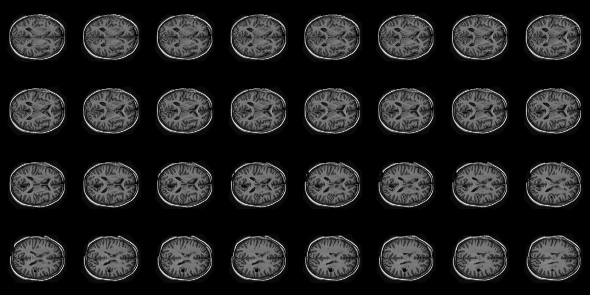
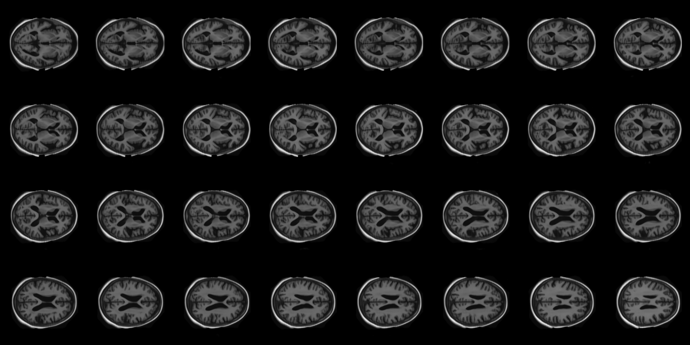
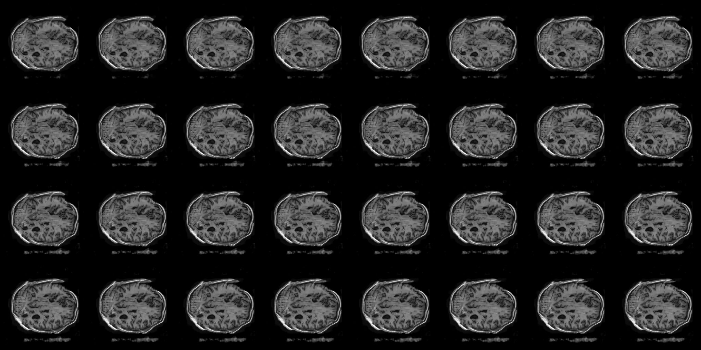
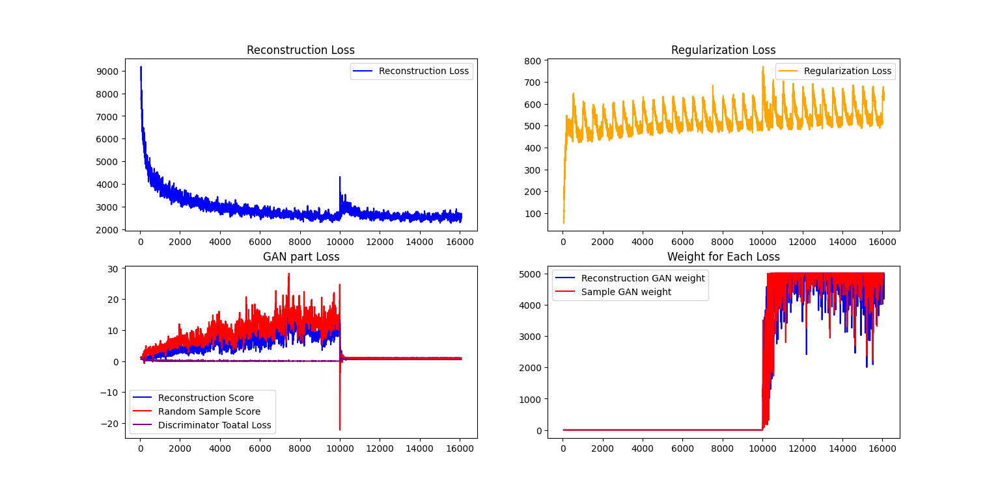
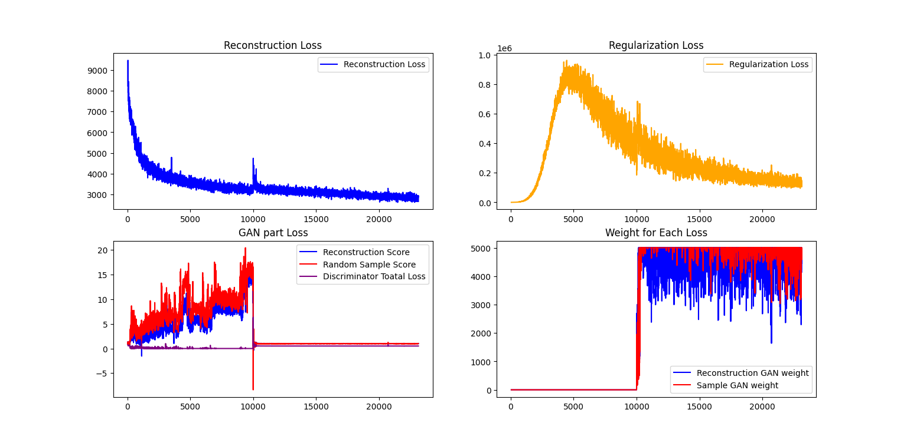
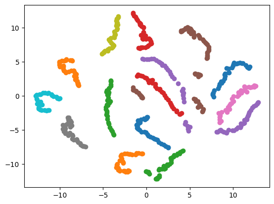

Stable Diffusion & VQVAE on OASIS 
===

# Project Overview

Implementation of Various generative model of OASIS dataset.

1. VAE-GAN

2. VQVAE with SSIM 0.766 (Task 8)

   > **Task 8**: Create a generative model of one of the OASIS brain, ADNI brain or the OAI AKOA knee data set using a VQVAE or VQVAE2 that has a "reasonably clear image" and a Structured Similarity (SSIM) of over 0.6. [Hard Difficulty]

3. VQGAN (VQVAE + Visual Transformer, I think it's somewhat related to Task 6 because I employ ViT in this repo.)

   > **Task 6**: Classify Alzheimer’s disease (normal and AD) of the ADNI brain data (see Appendix for link) using a visual or perceiver transformer set having a minimum accuracy of 0.8 on the test set. [Hard Difficulty]

4. Stable diffusion + VAE / VQVAE (Task 9)

   > **Task 9:** Create a generative model of one of the OASIS brain, ADNI brain or the OAI AKOA knee data set using either a variant of StyleGAN/StyleGAN2 or Stable Diffusion that has a "reasonably clear image". [Hard Difficulty]

*  `README.md / report.pdf` contains the key points of our work, while `tech_note.md / tech_note.pdf` provides details on previous work and how I used it to enhance this task.

## Files

### Non-Script
* `model_ckpt/*`: models' checkpoints.
* `collected_latents/*`: generate latent data for the second stage training.
* `log/*`: training log. (Can use `logger.py` to visualize it.)
* `visualize/*`: visualization of images when training.
* `playground/*`: some code to figure out some algorithms.
* `README.md / report.pdf`: The file you current see.
* `tech_note.md / tech_node.pdf`: The main algorithm I used.

### Common
* `util.py`: useful function, such as ssim, positional encoding.
* `module.py`: useful network module, such as resblock.
* `dataset.py`: get dataset from given folder.
* `logger.py`: script that can check the training log.

### First Stage
* `model_VAE.py`: `VAE` and `VQVAE` model for first stage.
* `model_discriminator.py`: The GAN part when training `VAE` or `VQVAE`.
* `pre_train.py`: Training Script for first stage.

### Second Stage
* `latent_dataset.py`: Collect the latent data given an first stage mode.
* `train_ViT.py`: Implement the Visual Transformer (ViT) for random image generation from VQVAE mode.
* `model_diffusion.py`: The model of stable diffusion. It's U-Net by the way.
* `stable_diffusion.py`: Implement stable diffusion when random generation from `VQVAE` or `VAE` model.

### Visualization

* `predict.py`: Reproduce SSIM score on task 8 and generate evolution gif on task 9. 


### About dataset & SSIM Score
* We trained our VQVAE on the train and validate dataset provided by the OASIS dataset. Then, we tested the SSIM score on the test dataset, which yielded a score of approximately 0.766.
  * It's important to note that the SSIM settings, such as the window size, are configured in the same way as those described on Wikipedia.
* In the second stage, we employed the entire dataset as the training data to train the LDM (Latent Diffusion Model) in the stable diffusion framework and Visual Transformer. This allowed us to generate images from random noise.

## Run

#### Requirements

```python
einops==0.6.1
torch==1.11.0+cu113
torchvision==0.12.0+cu113
tqdm==4.66.1
Pillow==9.0.1
numpy==1.22.2
matplotlib==3.5.1
imageio==2.22.4
```

#### Reproduce

1. `mkdir collected_latents model_ckpt`
2. For first stage
   1. run `pre_train.py`. You can select the mode among `VAE` and `VQVAE` in this script.
3. For second stage
   1. Choose which first stage model you use and run `latent_dataset.py`. This script will collect latent data.
   2. Choose which first stage model you use and run `train.py`. 
      1. If you want to use Transformer-like PixelCNN, you can run `train_ViT.py`
* To change dataset, you can modify folder path in `dataset.py`. The result images is trained on OASIS dataset.
* To predict task 8/9, modify parameters and run `predict.py`

## Results

#### VQVAE Reconstruction on Test Dataset

The image below is the first brain image from the test dataset, reconstructed by VQVAE. The SSIM score on the test dataset is approximately 0.766, significantly higher than the baseline of 0.6.


#### VQVAE + Random Generation

The image below is generated using weighted random sampling in the codebooks as the latent input and generated by the decoder.



#### VQVAE + VisionTransformer

The image below is generated using a transformer to predict the prior in the codebooks, and this prediction is used as the latent input for generation by the decoder.  (Note that this method is also referred to as VQGAN, which combines VQVAE, GAN, and Transformer techniques.)


#### VQVAE + Stable Diffusion

The image below is generated using a latent diffusion model, or stable diffusion, which denoises the latent representation obtained from a random normal distribution. This denoised latent is then used as the input for image generation by the decoder. Additionally, we have a z-index condition, to further constrain the latent and the generated image.


The image below represents the progression of stable diffusion. As time passes, the brain image becomes progressively clearer.

Note that the decoder of VQVAE is well-trained and can generate high-quality images without the need for a sophisticated model. Therefore, the effectiveness of the diffusion model lies in fine-tuning the generated image for finer details and improvements.

#### VAE Reconstruction on Test Dataset

The image below is the first brain image from the test dataset, reconstructed by VAE.



#### VAE + Random Generation

The image below is generated by sampling the latent space from a random normal distribution and then reconstructed by the VAE. It's important to note that the weight of the KLD loss is not set too high to prevent mode collapse. And that's why random generation failed to generate good brain images. However, we train this VAE solely for stable diffusion, so the latent space doesn't need to strictly conform to a normal distribution N(0, 1), which is acceptable.



#### VAE + Stable Diffusion

As you can see, whether the latent space between VAE is N(0, 1) or not, stable diffusion can effectively train it and generate relatively clear images.


The image below represents the progression of stable diffusion. As time passes, the brain image becomes progressively clearer.


## Algorithm Overview

1. I've applied VAE/VQVAE to the OASIS dataset, achieving a high SSIM score of approximately 0.766.
2. In the first stage of training, which involves training an autoencoder on the OASIS dataset, I have explored several enhancements:
   1. Introduced a GAN component to improve image reconstruction clarity (VAEGAN).
   2. Integrated an auxiliary loss to train the decoder (or generator) using random latent vectors as input due to the limited dataset availability.
   3. Employed the z-index of brain data as a conditioning factor to teach the model how to generate images with specific conditions (Pix2pix or conditional GAN).
   4. Implemented a cyclical annealing schedule for VAE to prevent mode collapse.
   5. For VQVAE, I employed a weighted sampler to sample the discrete latent space and used it to train the decoder and discriminator within the sampled space.
      * To be more specific, I collect the probability distribution of VQVAE indices every epoch. I then use this distribution for weighted sampling and apply the discriminator loss. This process allows the discriminator to generate images with noisy input.
3. After training the VQVAE, I applied several methods to generate the latent space:
   1. Random sampling from a normal distribution when using VAE model.
   2. Weighted random sampling of indices when using VQVAE model.
   3. Utilizing a Visual Transformer to create a random "sequence" on VQVAE latent indices.
   4. Applying DDPM (Denoising Diffusion Probabilistic Models) to the latent space, which is a fundamental concept in stable diffusion.
      - It's important to note that stable diffusion comprises two critical contributions: the application of DDPM to the latent space and cross-attention across different sequential conditions (such as image descriptions). However, due to the absence of sophisticated embeddings, we have opted to use a condition, namely, the z-index of the brain, to guide the diffusion model in generating the latent based on the provided z-index.

## Total Flow Chart


> Oops, I mis-drew this workflow. The generated latent should pass through the vector quantizer.

The detail of main concepts, related works and some training issues are in `tech_note.md`

## Training Curve
#### VAE



* The first plot is reconstruction loss, which is L1-loss between original image and reconstructed one.
* The second plot is KLD regularization term, which is $ -\frac{1}{2} (1 + \log  \sigma^2 -\sigma^2 - \mu^2)$. 
  * Why regulaization is looks so periodically is that the cyclic KLD weight is adopted. Details are comment in `tech_node.md`
* The third plot contains three score:
  * Reconstruction Score: $L_{recon} = -\text{Discriminator}(\text{Decoder} (\text{Encoder} (x)))$
  * Random Sample Score: $L_{aux} = -\text{Discriminator}(\text{Decoder} (N(0, 1)^{\text{latent shape}}))$
  * Discriminator Total Loss: $\frac{1}{4}(ReLU(1 - \text{Discriminator(x))}  + ReLU(1 + L_{recon} ) + ReLU(1 + L_{aux}))$.
    * Note that the loss of discriminator is Hinge Loss.
* The fourth plot represents the balance weight between the reconstruction loss and the GAN loss.
  * $w = ||\frac{\partial \,  L_{recon}}{\partial \, \text{Decoder}(\tilde z)} / \frac{\partial \,  L_{discriminator}}{\partial \, \text{Decoder}(\tilde z)}||_2$, and then clamp the value by $(0, 10^4)$ and multiplied by $0.5$.
  * This weight mechanism is applied to both the reconstruction and random sampling processes.

#### VQVAE


* All the losses follow the same pattern as the VAE training curve. In the second plot, the regularization loss corresponds to the codebook loss.

## Discussion & Analysis

After training lots of algorithm, I want to write some opinions here.

1. VAE & VQVAE:

   * Training VAE can be quite challenging, particularly in finding the right hyperparameters:

     - Setting `w_kld` too high can result in mode collapse or KL vanishing issues in VAE.
     - Setting `w_kld` too low can lead to convincing reconstruction loss, but the model may struggle to generate images from a notable distribution (e.g., a Gaussian distribution in Vanilla VAE).

   * On the other hand, VQVAE is comparatively easier to train. However, during VQVAE training, I observed that the discrete latents or indices tend to deviate from a uniform distribution. This behavior can lead to a lack of diversity or mode collapse. This issue could stem from two factors:

     1. It might be related to the design of the loss function, where each latent tends to approach the closest embedding. I believe there are potential methods to address this problem such as incorporating concepts like minibatch discrimination from GANs.
     2. Alternatively, the limited diversity of the OASIS dataset may contribute to this issue. Notably, many images in the OASIS dataset have black corners, and the similarity between brain images in the dataset can result in latent representations from the encoder that are too similar, hindering the generation of diverse discrete latents.

     

     > When examining the occurrence of indices in VQVAE, it becomes apparent that many embeddings appear to be useless, even though VQVAE successfully reconstructs high-quality images

2. Two-stage training for generative tasks:

   - Auto-regressive models perform well in vision tasks, but they have the disadvantage of slow inference due to the need for Denoising Diffusion (DDPM) to run T times (e.g., $T = 1000$ in the original DDPM paper) and the requirement for PixelCNN-like models to generate pixel by pixel. Real-time applications are challenging. Although some algorithms can predict faster, such as DDIM (Denoising Diffusion Implicit Models), this often compromises generation quality.
   - VAE/VQVAE can generate clear images with a bottleneck in the neural network. However, it's a significant challenge to constrain the latent space to follow a specific distribution.
   - Two-stage training, such as stable diffusion, combines the advantages of both models while mitigating their disadvantages. It's an inspiring and intelligent approach.

3. Does condition influence the latent space?

   * During training, I noticed that even when I didn't include the condition in the discriminator, but instead incorporated it into both the encoder and decoder, the generative model still recognized that the condition could assist in image reconstruction and influence random sample generation to produce images with the correct condition. Additionally, when we provided the same latent but with different z-indices for the brains, the resulting images shared similarities, resembling the same brain.
   * Does this mean that the latent space disentangles the condition and the brain data? Given the unique characteristics of the OASIS dataset, is it possible to ensure that every slice from the same brain produces the same latent representation generated by the encoder? If achieved, this would provide confidence in the task of taking a single brain slice and reconstructing the entire 3D brain. To investigate this, I conducted t-SNE visualization to explore the relationships between each set of samples.

   

   * Each brain has 32 slices and these 32 slices has same color. As you can see the latents after encoder will be the similar and quite different than other brain.
   * Here, I've considered an idea: what if we disentangle the condition and latent variables? Could it potentially enhance the task of brain image generation? To delve deeper, there are several methods I can envision for tackling this task:
     - Implement a disentangled GAN or create a single discriminator to assess whether the latent variables of images contain any condition information, akin to the concept of DaNN (Domain-adversarial Neural Networks).
     - Given that the OASIS dataset is a paired dataset, we could explore the implementation of a Siamese network with pair loss or triplet loss. This approach could bring the latent generated by the same brain with different z-indices closer together over time.
   * However, due to time constraints, I see this as a promising idea for future work.

## Reference

All references are provided in `tech_note.md` along with brief explanations.