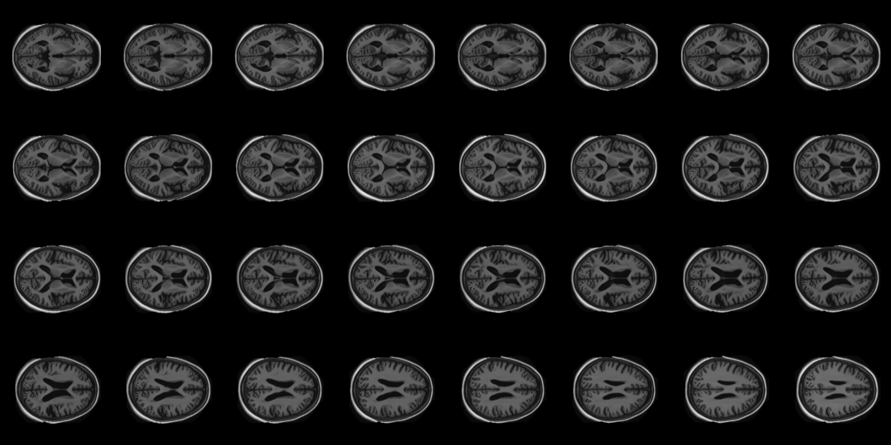
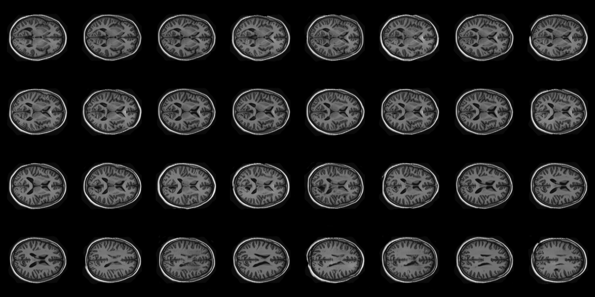
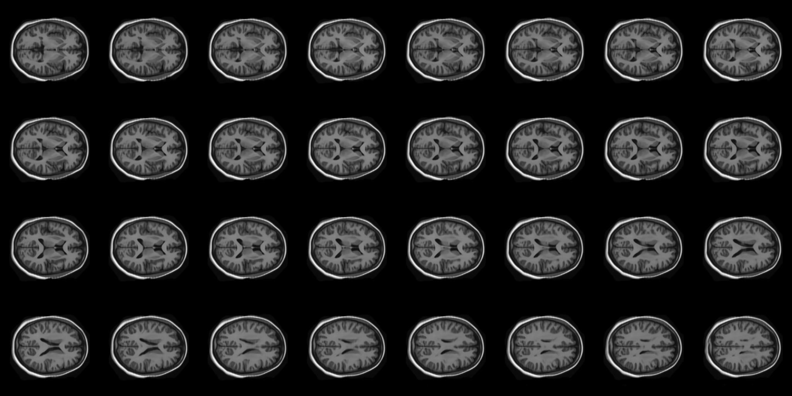
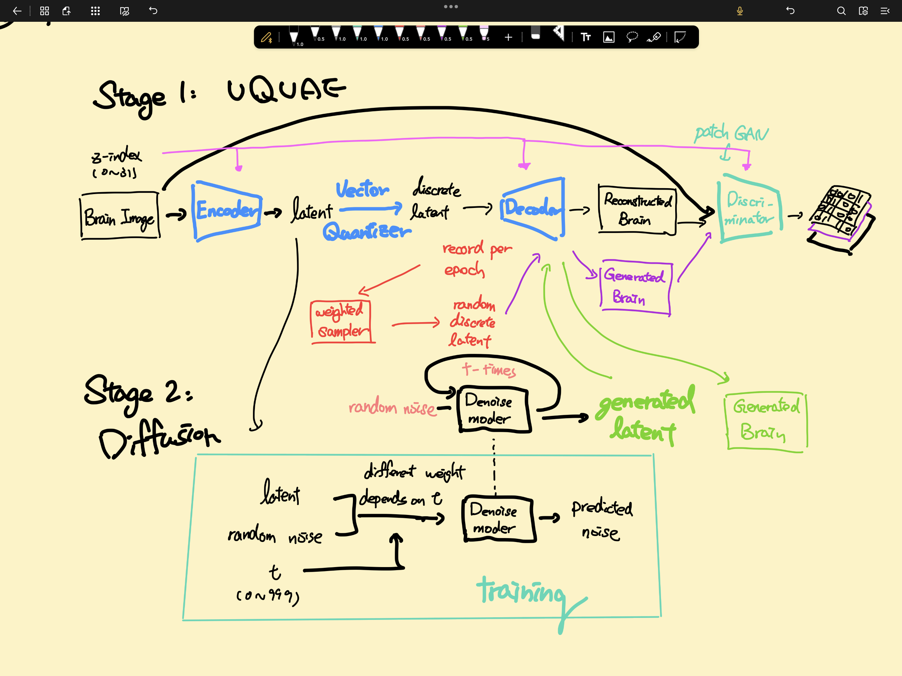

Stable Diffusion & VQVAE on OASIS 
===

# Project Overview

Implementation of Various generative model of OASIS dataset.

1. VAE-GAN
2. VQVAE with SSIM 0.78 (Task 8)
3. VQGAN (VQVAE + Transformer)
4. Stable diffusion + VAE / VQVAE (Task 9)

*  `README.md / report.pdf` contains the key points of our work, while `tech_note.md / tech_note.pdf` provides details on previous work and how I used it to enhance this task.

## Files

### Non-Script
* `model_ckpt\*`: models' checkpoints.
* `log\*`: training log. (Can use `logger.py` to visualize it.)
* `*_vis\*`: visualization of images when training.
* `playground`: we write some code to figure out some algorithms.
* `README.md / report.pdf`: The file you current see.
* `tech_note.md / tech_node.pdf`: The main algorithm I used.

### Common
* `util.py`: useful function, such as ssim, positional encoding.
* `module.py`: useful network module, such as resblock.
* `dataset.py`: get dataset from given folder.
* `logger.py`: script that can check the training log.

### First Stage
* `model_VAE.py`: `VAE` and `VQVAE` model for first stage.
* `model_discriminator.py`: The GAN part when training `VAE` or `VQVAE`.
* `prestage_train.py`: Training Script for first stage.

### Second Stage
* `latent_dataset.py`: Collect the latent data given an first stage mode.
* `pixelCNN.ipynb`: Do pixelCNN (here we use transformer) when random generation from VQVAE model.
* `model_diffusion.py`: The model of stable diffusion. It's UNet.
* `stable_diffusion.py`: Do stable diffusion when random generation from `VQVAE` or `VAE` model.
* `diffusion_visualize.py`: Generate the image through diffusion process.

### Visulization


### About dataset & SSIM Score
* We trained our VQVAE on the train and validate dataset provided by the OASIS dataset. Then, we tested the SSIM score on the test dataset, which yielded a score of approximately 0.766.
  * It's important to note that the SSIM settings, such as the window size, are configured in the same way as those described on Wikipedia.
* In the second stage, we employed the entire dataset as the training data to train the LDM (Latent Diffusion Model) in the stable diffusion framework. This allowed us to generate images from random noise.
* Furthermore, we also used a transformer and treated as PixelCNN to randomly generate brain images.

## Run

#### Requirements

```python
einops==0.6.1
torch==1.11.0+cu113
torchvision==0.12.0+cu113
tqdm==4.66.1
Pillow==9.0.1
numpy==1.22.2
matplotlib==3.5.1
imageio==2.22.4
```

#### Reproduce

1. `mkdir collected_latents model_ckpt`
2. For first stage
   1. run `pre_train.py`. You can select the mode among `VAE` and `VQVAE` in `line 27` in this script.
3. For second stage
   1. Choose which first stage model you use and run `latent_dataset.py`. This script will collect latent data.
   2. Choose which first stage model you use and run `train.py`. 
      1. If you want to use Transformer-like PixelCNN, you can run `pixelCNN.ipynb`
* To change dataset, you can modify folder path in `dataset.py`. The result images is trained on OASIS dataset.

## Results

#### VQVAE Reconstruction on Test Dataset

The image below is the first brain image from the test dataset, reconstructed by VQVAE.



#### VQVAE + Random Generation

The image below is generated using weighted random sampling in the codebooks as the latent input and generated by the decoder.


#### VQVAE + VisionTransformer

The image below is generated using a transformer to predict the prior in the codebooks, and this prediction is used as the latent input for generation by the decoder.  (Note that this method is also referred to as VQGAN, which combines VQVAE, GAN, and Transformer techniques.)



#### VQVAE + Stable Diffusion

The image below is generated using a latent diffusion model, or stable diffusion, which denoises the latent representation obtained from a random normal distribution. This denoised latent is then used as the input for image generation by the decoder. Additionally, we have a z-index condition, to further constrain the latent and the generated image.


The image below represents the progression of stable diffusion. As time passes, the brain image becomes progressively clearer.


#### VAE Reconstruction on Test Dataset

The image below is the first brain image from the test dataset, reconstructed by VAE.


#### VAE + Random Generation

The image below is generated by sampling the latent space from a random normal distribution and then reconstructed by the VAE. It's important to note that the weight of the KLD loss is not set too high to prevent mode collapse. And that's why random generation failed to generate good brain images. However, we train this VAE solely for stable diffusion, so the latent space doesn't need to strictly conform to a normal distribution N(0, 1), which is acceptable.


#### VAE + Stable Diffusion

As you can see, whether the latent space between VAE is N(0, 1) or not, stable diffusion can effectively train it and generate relatively clear images.



The image below represents the progression of stable diffusion. As time passes, the brain image becomes progressively clearer.


## Algorithm Overview

1. I've applied VAE/VQVAE to the OASIS dataset, achieving a high SSIM score of approximately 0.766.

2. In the first stage of training, which involves training an autoencoder on the OASIS dataset, I have explored several enhancements:
   1. Introduced a GAN component to improve image reconstruction clarity (VAEGAN).
   2. Utilized a transformer to predict the latent space (VQGAN).
   3. Integrated an auxiliary loss to train the decoder (or generator) using random latent vectors as input due to the limited dataset availability.
   4. Employed the z-index of brain data as a conditioning factor to teach the model how to generate images with specific conditions (Pix2pix or conditional GAN).
   5. Implemented a cyclical annealing schedule for VAE to prevent mode collapse.
   6. For VQVAE, I employed a weighted sampler to sample the discrete latent space and used it to train the decoder and discriminator within the sampled space.

3. After training the VQVAE, I applied DDPM (Denoising Diffusion Probabilistic Models) to the latent space, which is the core idea behind stable diffusion.
   * Stable diffusion encompasses two critical contributions: DDPM applied to the latent space and cross-attention across different modalities. However, as we don't have sophisticated embeddings, we opted to use a condition (the z-index of the brain) to guide the diffusion model in generating the latent based on the provided z-index.

## Total Flow Chart


> Oops, I mis-drew this workflow. The generated latent should pass through the vector quantizer.

The main concepts and related workds are in `tech_note.md`

## Training Curve
#### VAE


#### VQVAE


## Discussion

## Reference

All references are provided in `tech_note.md` along with brief explanations.