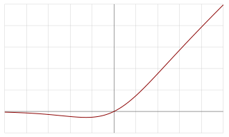
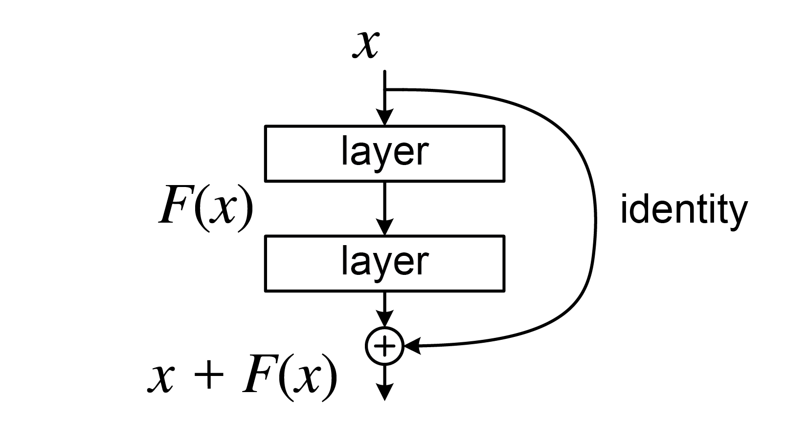
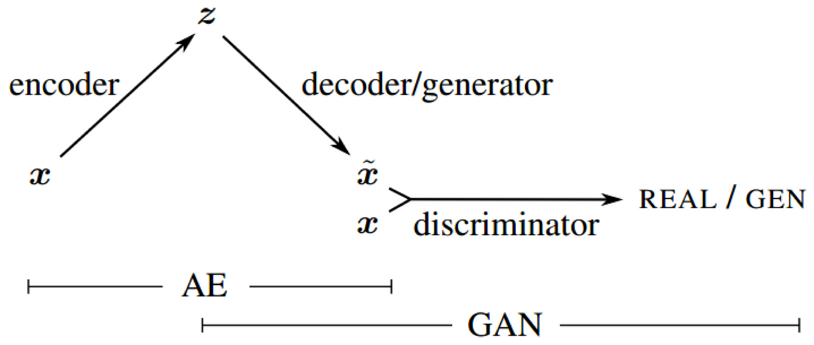
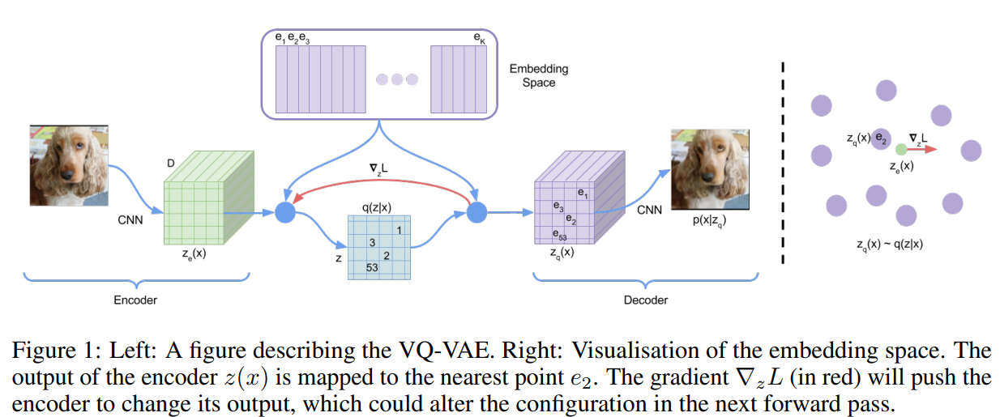
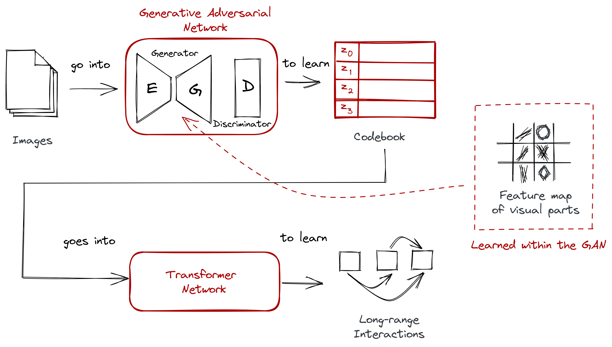
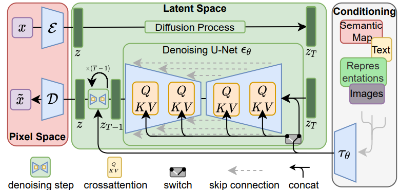

Tech Note
===

Here, I list all related works and describe their main concepts.


#### Swish
> [SEARCHING FOR ACTIVATION FUNCTIONS, ICLR 2018 workshop](https://arxiv.org/pdf/1710.05941.pdf)

Swish is an activation, which is defined as $f(x) = x \cdot \sigma ( \beta x)$.

In our code, we set $\beta = 1$ in all the Swish activation, and which is also known as "Sigmoid Linear Unit (SiLU)".

* Update: Pytorch has implementation of [SiLU](https://pytorch.org/docs/stable/generated/torch.nn.SiLU.html)



#### Group Normalization
> [Group Normalization, ECCV 2018](https://arxiv.org/abs/1803.08494)


Normalization: A method to train model faster and more stable through normalization of tinputs by re-centering and re-scaling.
* Batch normalization: Normalization for each channel.
* Layer normalization: Normalization for each sample.
* Instance normalization: Normalization for each sample and each channel.
* Group normalization: Normalization for each sample group.

> Note: If batch size is large enough, the performance: BN > GN > LN > IN 
> However, BN has GPU memory issue and cannot set large batch size sometimes. 
> Thus, we do GN in this task.

#### ResNet
> [Deep Residual Learning for Image Recognition, CVPR 2016](https://arxiv.org/pdf/1512.03385.pdf)



A popular module to very learn deep model by residual learning.

#### Self-Attention
> [Attention Is All You Need, NIPS 2017](https://arxiv.org/abs/1706.03762)

Self-attention, also known as scaled dot-product attention, is a crucial concept in the field of natural language processing (NLP) and deep learning, particularly within the context of transformer-based models. In pattern recognition task usually employ self-attention in each feature map, (therefore the weights in attention will be one by one convolution). Next, we will introduce what self-attention is.

Self-attention involves three key vectors for executing "attention to itself":

1. Query vectors: These query other elements in the sequence.
2. Key vectors: These define the importance relative to the current element.
3. Value vectors: These generate the output vectors.

After generating these three vectors, we follow these steps for each element:

1. Calculate the attention score, which is $W_{current, i} = K_{current} \cdot Q_{i}$, where $i \in [1, C]$, and $C$ is the input size.
2. Scale and softmax the score, which means $W_{current} = \text{softmax}\left(\frac{W_{current}}{\sqrt C}\right)$.
3. Generate the output, $H_{current} = W_{current} * V$.

Finally, to apply this method to convolutions, we can simply replace all linear layers with one-by-one convolutional layers, and everything will be fine.


> Flow chart of Self-Attention

#### Positional Encoding
> [Attention Is All You Need, NIPS 2017](https://arxiv.org/abs/1706.03762)

After applying the self-attention module in NLP, a crucial issue arises. Self-attention in NLP tasks lacks knowledge of the neuron's position within the sequence during its operation. Position is a critical factor in these tasks. Consequently, the authors introduced the idea of adding positional encoding to each neuron, using a sinusoidal embedding function, which was also introduced in the same paper 'The Attention Is All You Need'.

The provided sinusoidal embedding formula can be presented as follows:
```
EMB[pos, 2i]  = sin(pos / 10000^(2i/d_model))
EMB[pos, 2i+1]= cos(pos / 10000^(2i/d_model))
```
This formula is used to calculate the values for the positional encoding matrix, where pos represents the position of a token or neuron, i is the index of the dimension, and d_model is the model's dimensionality.

#### Variational Autoencoder (VAE)
> [Auto-Encoding Variational Baye, ICLR 2014](https://arxiv.org/abs/1312.6114)

This paper introduce what VAE is.


> Flow chart of VAE.

The most important thing that VAE aims to solve is to make it easier for us to generate random images from the latent space. We need to know what distribution the latent space, encoded by the encoder, follows, but this problem is quite challenging. Therefore, we can approach it from a different perspective: constraining the latent code generated by the encoder to be similar to a well-known distribution, typically a Gaussian distribution.

But how do we calculate the regularization term? Next, we will explore what the regularization term should be if we use the KL divergence to measure the distance between the latent space and a Gaussian distribution.

Notation: $q$ is encoder, $z$ is latent.

* For an showed image $x$, we need to maximize the log probability (because of max likelihood) $x$ generated by AE, $p(x)$.

  * $\log p(x) = \log \int_z p(x, z) dz = \log \int_z p(x, z) \frac{q(z|x)}{q(z|x)} dz$
  * By Jensen's inequality, $\log p(x) \ge \mathbb E_{q(z|x)} \log \frac{p(x, z)}{q(z|x)} dz$
  * By Bayes' theorem, $\log p(x) \ge \mathbb E_{q(z|x)} \log \frac{p(x|z) p(z)}{q(z|x)}$
    * $= \mathbb E_{q(z|x)} \log p(x|z)  + \mathbb E_{q(z|x)} \log \frac{p(z)}{q(z|x)}$
    * $= \mathbb E_{q(z|x)} \log p(x|z)  + \int_z q(z|x) \log \frac{p(z)}{q(z|x)}$
    * $= \mathbb E_{q(z|x)} \log p(x|z)  - D_{KL}[q(z|x)||p(z)]$
    * $= Maxlikelihood - D_{KL}[q(z|x)||p(z)]$

* Where we assume $p(z)$ is gaussian distribution $N(0, 1)$, and $q(z|x)$ is $N(\mu, \sigma)$ 

  * Recall that $N(\mu, \sigma) = \frac{1}{\sigma \cdot \sqrt {2\pi}} \exp(-\frac  12 (\frac {x-\mu}{\sigma})^2) $

    * $\log N(\mu, \sigma) = \log \frac{1}{\sqrt{2\pi}} - \log \sigma -\frac  12 (\frac {x-\mu}{\sigma})^2 $

  * $D_{KL}[N(\mu, \sigma)||N(0, 1)] = \int N(\mu, \sigma) [ (\log \frac{1}{\sqrt{2\pi}} - \log \frac{1}{\sqrt{2\pi}}) - (\log \sigma - \log 1)  - \frac{1}{2}((\frac{x - \mu}{\sigma})^2 -(\frac{x - 0}{1})^2)] dx$

    * $= \mathbb E_{N(\mu, \sigma)} [ - \log \sigma  - \frac{1}{2}((\frac{x - \mu}{\sigma})^2 - x^2)]$
    * $= -\log \sigma -\frac {1}{2\sigma ^2} \mathbb E_{N(\mu, \sigma)}[(x - \mu)^2] +  \mathbb  E_{N(\mu, \sigma)}[x^2]$
    * $= -\log \sigma - \frac 12 +  \mathbb  E_{N(\mu, \sigma)}[x^2]$
      * $\sigma^2 = \mathbb E[x^2] - \mathbb  E[x]^2 \rightarrow \mathbb E[x^2] = \mu^2 + \sigma^2$
    * $= - \log \sigma - \frac 12 - \frac 12( \sigma^2 + \mu^2)$
    * $= -\frac{1}{2} (1 + \log  \sigma^2 -\sigma^2 - \mu^2)$
  * Thus, the regularization term for KL divergence is $= -\frac{1}{2} (1 + \log \sigma^2 - \sigma^2 - \mu^2)$. If we modify the encoder from an image to some $\mu$ and $\sigma$, and sample the latent variable from $N(\mu, \sigma)$, then we can apply this term.

#### KLD Loss Scheduler
> [Cyclical Annealing Schedule: A Simple Approach to Mitigating KL Vanishing (NAACL 2019)](https://github.com/haofuml/cyclical_annealing)

Balancing the weights of VAE_loss and KLD_loss is a challenging task. If we set VAE_loss too high, clear images won't be generated from sampling the latent space because it won't match the decoder's distribution. Conversely, if we set KLD_loss too high, the autoencoder may tend to experience mode collapse and ignore the reconstruction loss term. To mitigate this issue, we employ a technique known as the cyclical annealing scheduler, which periodically adjusts the weight of KLD_loss.


#### VAE-GAN
> [autoencoding beyond pixels using a learned similarity metric (ICML 2016)](https://arxiv.org/abs/1512.09300)

Because the image generated from the vanilla VAE is too blurry, we can use GAN to mitigate this phenomenon. 
To prevent mode collapse from occurring too early, we only train the GAN part from a specific iteration.



#### Conditional GAN & PatchGAN
> [Image-to-Image Translation with Conditional Adversarial Networks (CVPR 2017)](https://openaccess.thecvf.com/content_cvpr_2017/papers/Isola_Image-To-Image_Translation_With_CVPR_2017_paper.pdf)

We have incorporated two concepts from this paper: conditional GAN and Patch GAN.

Our task is to reconstruct brains, and we have observed that each brain generates 32 images with different z-index values. This additional information enables us to implement conditional GAN, leveraging this extra condition to enhance the quality of randomly generated images.

Instead of using regular embedding, we have opted for sinusoidal embedding in the z-index and have added these positional encodings after the feature map passes through the convolutional layers in both the autoencoder and discriminator.


The original discriminator in GANs aims to predict whether the entire image is real or fake, whereas PatchGAN is designed to predict the reality of individual patches or windows within the image. I believe that this approach provides better guidance to the generator for capturing and generating detailed features in the image.


#### VQVAE
> [Neural Discrete Representation Learning (NIPS 2017)](https://papers.nips.cc/paper_files/paper/2017/hash/7a98af17e63a0ac09ce2e96d03992fbc-Abstract.html)

Because the latent space in VAE is continuous, it is challenging to sample from it, even with the addition of a KLD regularization term during VAE training to constrain the latent space to be similar to the Normal Distribution N(0, 1). This paper introduces a method to discretize the latent space, making it possible to sample from a discrete space. Furthermore, since the latent space is discrete and reduced in size, we can employ an powerful auto-regressive model to generate the latent values. For instance, the author of this paper uses PixelCNN as the decoder.



The next problem is how to discretize the latent space while still allowing for network updates through gradients. 
The discretization layer is not differentiable. To address this challenge, VQVAE employs three losses:

1. Reconstruction Loss: This is equivalent to VAE.
2. Loss to make the embedding layer (or discrete latent) similar to the latent vector generated by the encoder.
3. The same as 2, but in reversed. 
   * Note that we don't want the encoder to generate the discrete latent directly, so this term is multiplied by `beta`, with the `beta` value in the paper set to 0.25.

After applying these three losses, your VQVAE will be successfully trained.

Furthermore, there's VQVAE2, which discretizes the latent space into two layers. However, due to time constraints, I don't have the opportunity to explore this approach.


#### VQGAN
> [VQGAN (Taming Transformers for High-Resolution Image Synthesis, CVPR 2021)](https://openaccess.thecvf.com/content/CVPR2021/html/Esser_Taming_Transformers_for_High-Resolution_Image_Synthesis_CVPR_2021_paper.html)

This paper improves VQVAE with two key concepts:

1. It adds a GAN component (or discriminator) at the end of the VAE.
2. It utilizes a transformer, as opposed to PixelCNN, for sampling in the latent space.



## DDPM
> [Denoising Diffusion Probabilistic Models](https://arxiv.org/abs/2006.11239)

Diffusion Probabilistic Models (DDPM) is a generative modeling approach that represents data as the result of a diffusion process. It models how data evolves over time, adding noise gradually according to a schedule. Invertible neural networks are used to capture this process, enabling the generation of data samples and likelihood estimation. DDPM is known for its ability to generate high-quality data samples.


Nevertheless, training a diffusion model on raw images is a time-consuming process. To strike a balance, there's a compromise method: applying DDPM to a smaller latent space, which is generated by the VAE's encoder. This approach is one of the main contributions to stable diffusion.

#### Stable Diffusion
> [High-Resolution Image Synthesis with Latent Diffusion Models (Stable Diffusion)](https://arxiv.org/abs/2112.10752)




Stable diffusion comprises with two key contributions: DDPM on the latent space and cross-attention across different modalities. However, since the OASIS dataset lacks of other conditions, we did not implement cross-attention in this repository.