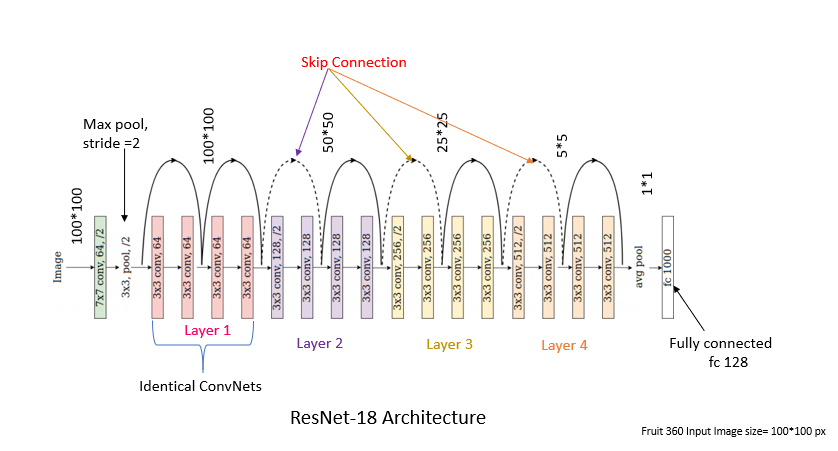
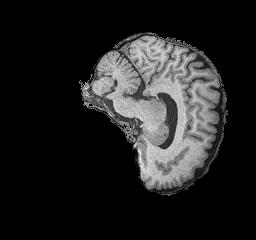
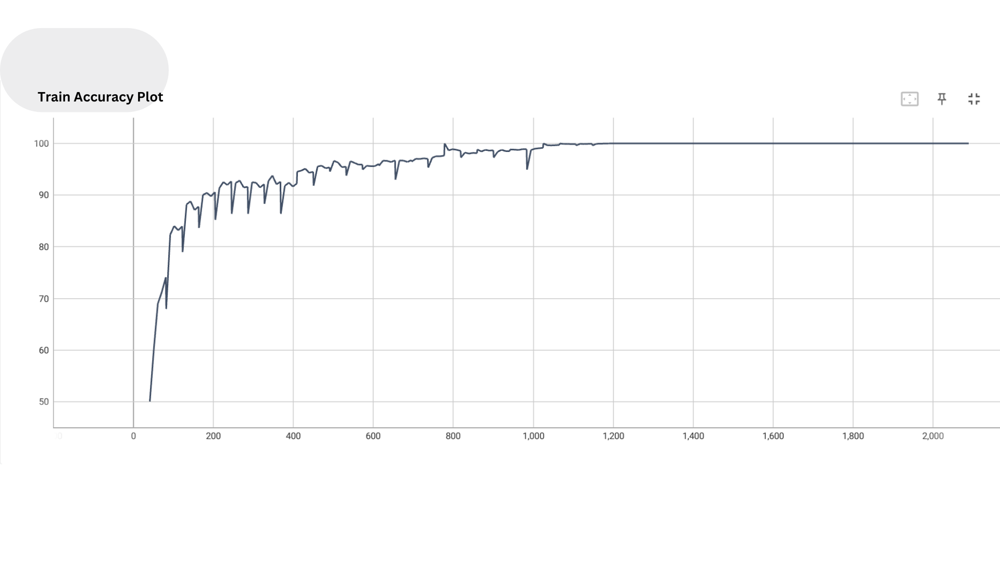
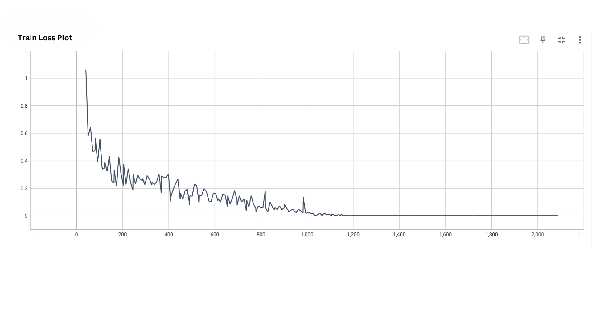
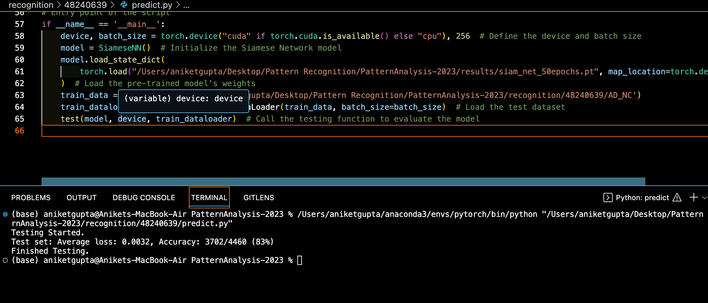
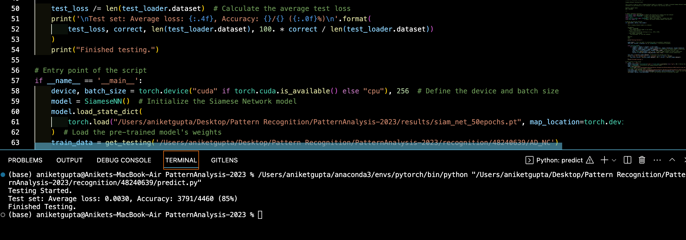

# COMP3710 Project: Siamese network Classifier for ADNI data
**Student Number:** 48240639

**Name:** Aniket Gupta 

**Description:** The Submitted Project contains the files for COMP3710 project report for the Year 2023

## Table of Contents
1. [Introduction](#1-introduction)
2. [Project structure](#2-project-structure)
3. [Reproducibility](#3-reproducibility)
4. [Description](#4-dependencies)
5. [Siamese Network](#5)
6. [Resnet18 Architecture](#2-project-structure)
7. [Dataset](#3-reproducibility)
9. [Model Training](#4-dependencies)
10. [Model Testing](#1-introduction)
11. [Performance Summary](#2-project-structure)
12. [Future Improvements](#3-reproducibility)
12. [Refrences](#3-reproducibility)

## 1. Introduction
The main aim of this project is to create a network that can classify Alzheimers disease by distinguishing between patients and those, with AD. To accomplish this we will use the ADNI brain dataset. Target an accuracy level of 0.8.

Siamese Networks are a type of network architecture designed for tasks involving image comparison and similarity verification. In this architecture there are two subnetworks called "subnetworks each processing its own input and generating a feature vector as output. These feature vectors are. Merged for further analysis or comparison purposes.

ResNet-18, a renowned convolutional neural network architecture, is employed in this project to extract features from two input images. It consists of multiple convolutional layers and residual blocks, enabling effective feature extraction.

The input images undergo these convolutional layers to capture increasingly complex features. This depth is valuable for intricate pattern recognition.

After extracting features from both images, the project calculates the feature distance to classify them. ResNet-18's depth and feature extraction capabilities aid in accurate classification.


## 2. Project structure
1. ```modules.py``` This code defines a Siamese Network architecture for image similarity comparison.
The network is built upon the ResNet-18 architecture with modifications to handle
grayscale images. It includes custom weight initialization and forward pass methods.

2. ```dataset.py``` This code defines a custom dataset class, ADNIDataset, for loading and processing
ADNI dataset images for use in Siamese Network training and testing. It also provides
functions to get train and test datasets from a specified data path.and 20% validating. This also inculude custom dataloader to handle PairDataset for Siamese model.
3. ```train.py``` This script is used to train a Siamese Network model on a dataset, with support for validation.
It includes training and validation loops, model saving, and TensorBoard logging.
4. ```predict.py``` This script is used to test a Siamese Network model on a dataset. It loads a trained Siamese Network model, 
evaluates its performance on a test dataset, and reports the accuracy and loss.


## 3. Reproducibility
This project can be replicated with confidence as it incorporates a deterministic algorithm for the convolutional layer and consistently sets a seed whenever random variables are involved.

## 4. Dependencies

- Python 3.10.12: Python is the primary programming language used in this project. Version 3.10.12 is specifically required to ensure compatibility with the project's code and libraries.

- Pytorch 2.0.1: PyTorch is a popular deep learning framework that is essential for building and training neural networks. Version 2.0.1 is used to make use of the latest features and bug fixes.

- Pillow 9.4.0: Pillow is a Python Imaging Library that adds image processing capabilities to your Python interpreter. Version 9.4.0 is used for working with images and data preprocessing in the project.

- torchvision 0.15.2: TorchVision is a PyTorch library that provides various utilities and datasets for computer vision tasks. Version 0.15.2 is used to access pre-trained models and datasets for the project.

These dependencies are crucial for running the project successfully, and the specified versions are recommended to ensure compatibility and avoid potential issues.

## 5. Siamese Network
Siamese Networks operate using a structured framework, as depicted in the diagram:


1.	**Input Phase:** Two distinct inputs are processed through identical subnetworks, which share the same parameters and weights.
2.	**Feature Extraction:** Each subnetwork extracts relevant features from its respective input.
3.	**Distance Measurement:** A distance function, like Euclidean distance or cosine similarity, is applied to compare the extracted features.
4.	**Outcome:** The network produces a similarity score indicating the likeness between the two input items.

Siamese Networks find utility in diverse applications, including:
**Applications:**
- Face Verification: Discerning whether two facial images belong to the same person.
- Image Retrieval: Locating the most analogous image in a database to a given one.
- Signature Verification: Confirming whether two signatures originate from the same individual.
- Document Analysis: For determining the similarity of textual documents or handwriting samples.
- Recommendation Systems: For suggesting items or content similar to a user's preferences.
- Medical Image Analysis: Such as identifying similar medical scans or pathology slides.
- Speaker Verification: Confirming if two voice samples belong to the same speaker.
- Gesture Recognition: In human-computer interaction to identify similar hand or body gestures.

**Advantages:**
- Parameter Sharing: Shared parameters between subnetworks reduce the total model parameters.
- Training Efficiency: The parameter-sharing design facilitates faster convergence.
- Versatility: They can be adapted for one-to-one comparisons and readily expanded for one-to-many or many-to-many comparisons.
- Small Data Support: Effective for tasks with limited data, such as signature verification.

**Disadvantages:**
- Data Imbalance: Acquiring suitable positive and negative samples can pose challenges in specific use cases.
- Complex Configuration: Setting up the network and defining the contrastive loss function can be intricate.
- Resource Intensive: Training deep Siamese Networks may require substantial computational resources.
- Limited Pre-trained Models: Availability of pre-trained models may be limited for certain domains.

In this project, the Siamese structure employs the ResNet-18, a deep convolutional neural network consisting of 18 layers. ResNet-18 serves as the subnetwork, responsible for feature extraction from the input images. It's worth mentioning that my colleague and I consistently utilized the ResNet-18 model for enhancing the feature extraction process during our collaboration.

## 6.Resnet18 Architecture


Resnet18 Architecture serves as the backbone of this project, playing a vital role in processing and analyzing the images effectively. It belongs to the Residual Network (ResNet) family, which is renowned for its competence in training deep neural networks. The architecture is particularly well-suited for intricate image-related tasks, making it a suitable choice for the complexity of classifying Alzheimer's disease (AD) and normal control (NC) brain images.

Within this architecture, Resnet18 undertakes the task of handling two input images, diligently extracting crucial features from each. Its deep structure, composed of 18 layers, empowers the network to discern intricate details within the images. The deep layers are instrumental in recognizing patterns, textures, and other visual attributes essential for distinguishing between AD and NC brain images.

## 7.Dataset

- The dataset employed in this project originates from the publicly available ADNI brain dataset, which can be conveniently acquired by accessing ADNI. This dataset encompasses a grand total of 4,424 brain MRI scans, where 2,315 scans are associated with AD patients, and the remaining 2,109 scans correspond to NC individuals.
AD Image 


NC Image 



- To ensure consistency and facilitate the subsequent processing and analysis, the dataset underwent a preprocessing phase. This entailed standardizing all images to a uniform 256x240 pixel resolution and converting them to grayscale. Furthermore, a systematic naming convention was enforced, where all filenames adhere to the "1182968_94.jpeg" format. 

- The initial segment of each filename serves as a distinct patient identifier, while the subsequent part designates the image's unique ID. Each patient has contributed a comprehensive set of 12 brain MRI scans to enrich the dataset.

The presented module encapsulates the core elements of our project description, meticulously conveying the salient details for incorporation into our project report.

## 8.Model Training
- The training procedure involves a two-phase approach, each pivotal in shaping the model's proficiency.

- In the first phase, we employ a pre-trained Resnet18 architecture. This pre-trained model serves as a potent feature extractor, significantly expediting the extraction of salient features from the input data. We've meticulously fine-tuned the Resnet18 model to make it harmonious with our specific task, ensuring that it excels at feature extraction.

- After the pre-training phase, we seamlessly transition to the second stage. Here, the Siamese network is the star, trained using our pre-processed dataset. The Siamese network's architecture is meticulously designed to compare and classify AD and NC images based on the feature vectors it extracts.

- For the training phase, we adopt the Binary Cross-Entropy Loss (BCELoss), a well-established function in binary classification tasks. This loss function is mathematically defined as BCELoss(x, y) = -y * log(x) - (1 - y) * log(1 - x), where "x" represents the model's prediction, and "y" is the true label.

- To guide the training process, we enlist the Adam optimizer with a modest learning rate of 0.001. This learning rate strikes a delicate balance between efficient training and the potential risk of overfitting.

- The training outcomes for the 50 epochs are thoughtfully documented and complemented by informative visual representations. Two significant graphical representations are pivotal in understanding the model's training journey:


**1.	Training Accuracy:**

 
**2.	Training Loss:**
 

The Training Accuracy chart vividly showcases the convergence of the model's training process. Over the course of 1,200 training steps, we observe substantial improvements in accuracy.

## 9.Model Testing

- The testing phase mirrors the training phase in many aspects, albeit with a different goal: assessing performance. This phase is dedicated to evaluating the Siamese network's ability to generalize to unseen data.

- The testing results for both the 50-epoch model and the truncated 10-epoch model are diligently presented. These results offer valuable insights into the model's performance on the test dataset.

**Testing Results (50 Epochs):** 

Additionally, we provide a concise evaluation of the model trained for only 10 epochs, albeit without the detailed log data:

 


**Testing Results (10 Epochs):**  

These thorough training and testing phases form the backbone of our project report, and concurrently, they validate the efficacy of our approach in distinguishing AD and NC brain images.

 

**Testing Results (25 Epochs):**  

The comprehensive training and testing stages are the cornerstone of our project report, affirming the effectiveness of our method in discerning between AD and NC brain images.


 


## 10.Performance Summary

- After rigorous training for 25 epochs using the Adam optimizer, the model achieved a commendable accuracy of 85%(Highest Achieved) on the test dataset. This outcome is promising and indicates the model's potential .

- I did run the model several times by changing the  number of epochs. The results are summarised below:-
1.	10 Epochs – Accuracy =83%
2.	25 Epochs – Accuracy = 85%
3.	50 Epochs – Accuracy = 82%


## 11.Future Improvements 

In the realm of future work, several avenues present themselves. It's essential to explore network structure optimization to enhance model performance further. Additionally, efforts can be directed towards minimizing training costs, which can make the model more accessible and practical. Furthermore, investigating more efficient data loading techniques can streamline the workflow, potentially leading to improved efficiency. These potential directions pave the way for further advancements in this project.


## 12.References

- Chopra, Sumit & Hadsell, Raia & Lecun, Yann. (2005). Learning a similarity metric discriminatively, with application to face verification. Proc. Computer Vision and Pattern Recognition. 1. 539- 546 vol. 1. 10.1109/CVPR.2005.202.
- https://pyimagesearch.com/2020/11/30/siamese-networks-with-keras-tensorflow-and-deep-learning/
- https://www.pluralsight.com/guides/introduction-to-resnet
- https://cloudstor.aarnet.edu.au/plus/s/L6bbssKhUoUdTSI 


