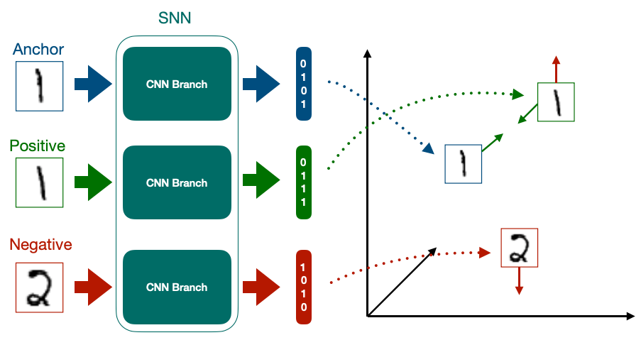
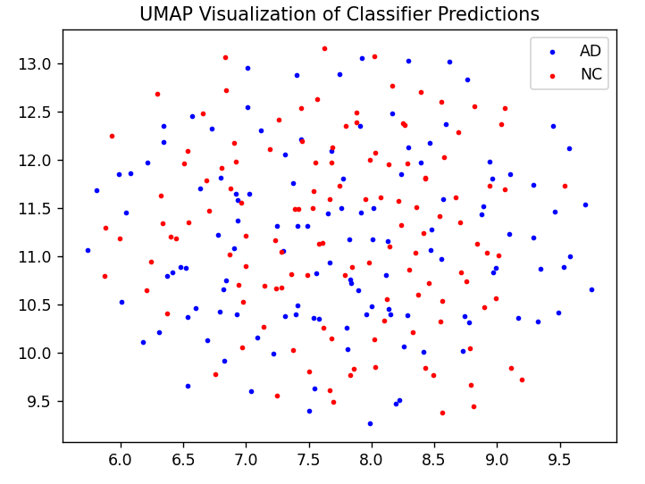
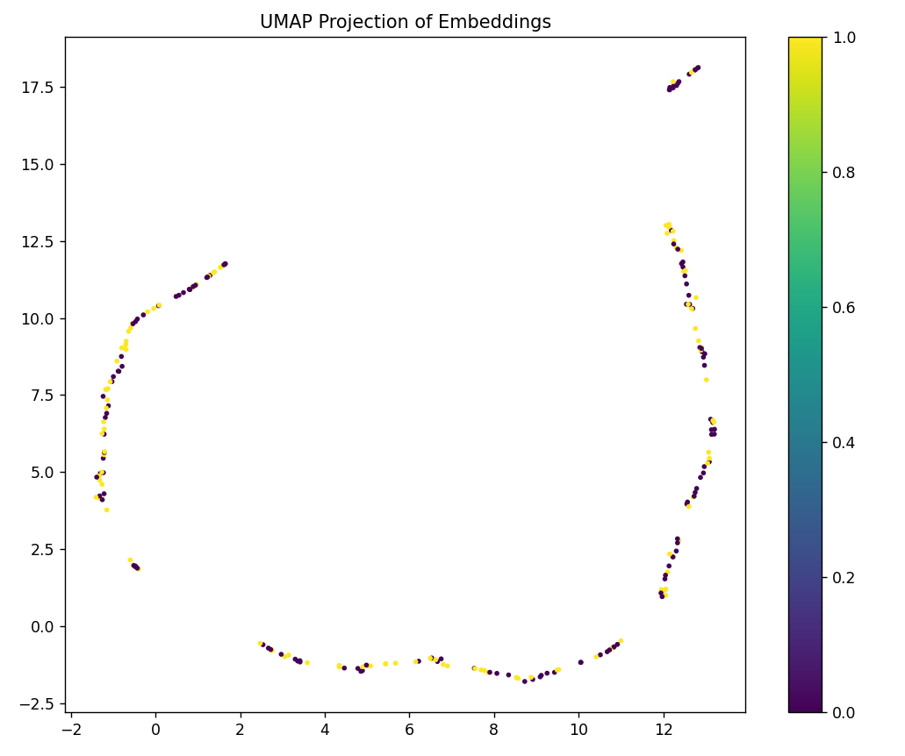
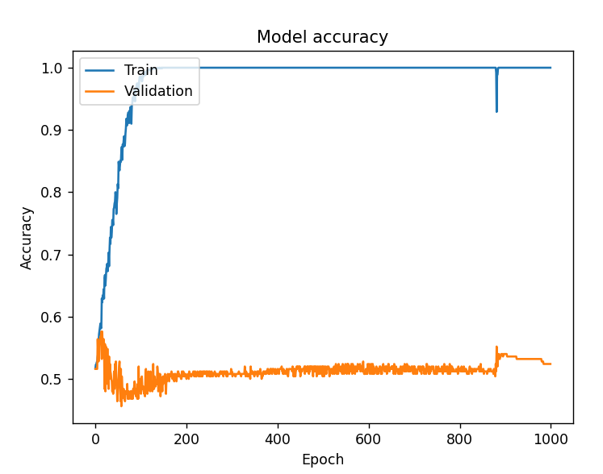

# Classifier based on Siamese Network
## Model Architecture and Problem
Siamese neural networks have 2 or more inputs, with each subnetwork sharing the same 
architecture and the same weights. 
Two input Siamese networks use embeddings in order to rank the similarity between different inputs 
([oneshot1](https://www.cs.cmu.edu/~rsalakhu/papers/oneshot1.pdf)).
When extended to three inputs, an input anchor is compared to a positive (same) class and a 
negative (not same) class, with the error generally trying to minimise the distance between
the anchor and positive class, and maximise the distance between the anchor and the 
negative class. 
From these embeddings, a classifier could be trained based on these embeddings in order to 
make class-specific predictions. 
The aim of this project aims to analyse the ADNI dataset for Alzeimers disease, and using
the architecture based off of a siamese neural network, make predictions into either
class "AD" (Alzeimers Disease) or "NC" (Normal Cognition).  




## Installations
To run this prgram, a few dependencies will need to be installed. Each of these can be 
installed via the commandline. Below shows the proper commands plus a brief explanation:

### TensorFlow 2.13.0
This project relies on TensorFlow for neural network creation and as such requires tensorflow. 
This can be installed via the command prompt using:
```
pip install tensorflow==2.13.0
```
### MatPlotLib
This program outputs several visualisation plots and thus requires Matplotlib. 
```
pip install matplotlib
```
### scikit-learn
This program uses scikit-learn in order to determine the accuracy of the classifier. 
```
pip install scikit-learn
```
### TensorFlow_AddOns
TripleSemiHardLoss was used for the training of the neural network. 
```
pip install tensorflow-addons
```
### UMAP
UMAP has been used in order to determine the class regions
```
pip install umap-learn
```


## How to run

```
### **IMPORTANT**
Before running any programs, make sure the file path for the train and test set 
in dataset.py is set to the correct path. It has been assumed that the "AD_NC" folder
whih contains all of the data is in the current working directory. However, if the data path is not
in the current working directory, change the path variable on lines 25 and 33. 

```

There are two runnable files for this project:

### train.py
Program that trains both the siamese neural network and the classification model. Note, for the 
training of the siamese network, anchor, pos, neg triples need to be created. The current 
working device was able to do up to 1000 data points before the limit of the hardware was reached. 
If the number of data points needs to be changed, in the main method, edit lines 109-110, and lines 113-114. 

```
Run this file before predict.py
```

### predict.py
Program that runs to make predictions, and evaluate the model trained in train.py. 

Upon running this program, the weights created in predict.py will be loaded into a model, 
and various plots will be displayed to show the effect of using the Siamese model.

line 42
## Example Use
The main task of this is to attempt to classify the ADNI dataset as either AD (Alzeimers disease) or NC 
(normal cognition). Initially, there does not appear to be any pattern to the image. 



However, lets see if the data can be classified using the siamese model. 

Assuming the model has already been trained, to classify this data first:
### 1. Load Anchor Embeddings
First, start by creating a model with the same weights as siamese_model.h5. 

```
embedder = Modules().base_network()
embedder.load_weights("siamese_model.h5", by_name=True, skip_mismatch=True)
```
### 2. Retrieve embedded information
After getting the embedder, the embedded information can be found for the test embeddings:
```
test_embeddings = embedder.predict(test_embeddings)
```
### 3. Create classifier
From here, a classifier instance can be created, and the weights from test.py can be loaded up:
```
classifier = Modules().base_network()
classifier.load_weights("best_classifier_model.h5", by_name=True, skip_mismatch=True)
```
### 4. Predict classes
From here, classes of data are able to be predicted using the classifier based on the test embeddings:
```
classifier.predict(test_embeddings)
```

### 5. Calculate accuracy
Finally, taking the number of correct classifications divided by the total number in the sample can give the accuracy. 
```
accuracy = accuracy_score(tf.argmax(test_labels, axis=1), predicted_labels)
```

The above plot shows the same classes after undergoing the classifier. Even though the data has been transformed, it is 
quite obvious that the model is not able to find change between classes. While there is more of a "structure" to the code, 
in the sense that it is in a circular line, no class has any specific region. This is further supported when looking at the validation
accuracy curves 


## Preprocessing and Data Augumentation
Image data generators were chosen as not only are they computationally cheap, they also allow
for data Augumentation quite easily. 
Typically the data was normalized, however, it also allowed for random variences such as pizel dimension, rotation etc.

Attempts were made to try and load the data generator into the model. Results found that the model
while training on the dataset would take substancial time per iteration. 
As such, only a subset of features were trained and tested upon. 