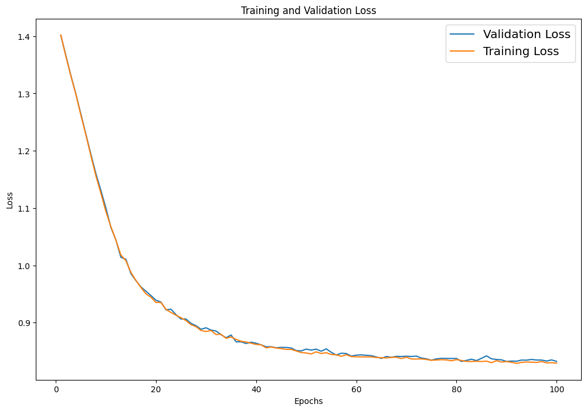
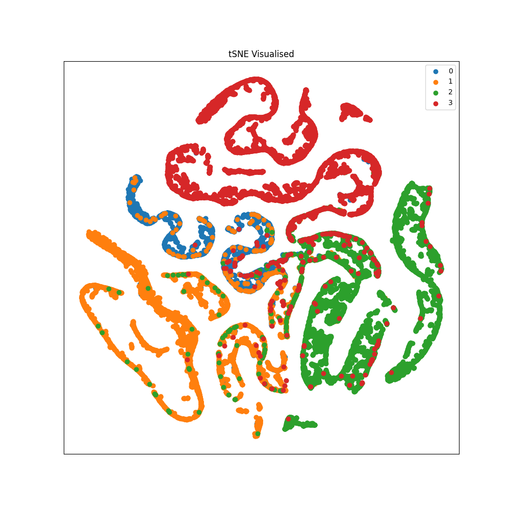

# Multi-Class Node Classification of Facebook Network Dataset Using GCN

## Dataset Background

The [Facebook Large Page-Page Network](https://snap.stanford.edu/data/facebook-large-page-page-network.html) was utilized in this project. This dataset presents a page-to-page graphical representation of Facebook websites classified into 4 distinct categories: (0) Politicians, (1) Governmental Organizations, (2) Television Shows, and (3) Companies. In this graph, nodes correspond to individual Facebook pages, while edges between nodes signify mutual likes between pages. The dataset comprises 22,470 nodes, each with 128 features extracted from the site descriptions provided by the page owners, along with 171,002 edges.

## Algorithm

The main algorithm employed in this project is a multi-layer Graph Convolutional Network (GCN). This network conducts semi-supervised multi-class node classification on the Facebook dataset, aiming to categorize each of the Facebook pages (nodes) into one of the previously mentioned four categories: (0) Politicians, (1) Governmental Organizations, (2) Television Shows, and (3) Companies. Additionally, a T-Distributed Stochastic Embedding (t-SNE) is utilized to visualize the high-dimensional Facebook page data in a more comprehensible form (two dimensions).

## Problem That It Solves

As mentioned earlier, the goal of this project is to assign each of the Facebook pages to one of four categories. This task holds significant implications in various real-world scenarios. Particularly, the application of a machine learning algorithm to discern the nature of social media accounts would be invaluable for data mining and advertising enterprises. To enhance the efficiency of advertisements, precision targeting is crucial to reach the intended audience. Employing an algorithm to swiftly categorize a page enables companies to tailor advertisements that would resonate with the specific audience of that page. For example, a user visiting a social media page dedicated to a television show would likely exhibit interest in streaming services like Netflix. By utilizing the GCN to identify the page as a 'television show,' an advertising company can effectively direct Netflix advertisements to this page, thereby maximizing the impact of the ad.

## How it Works

Regular Convolutional Neural Networks (CNNs) employ a filter, also known as a kernel, to traverse the input matrix, performing element-wise multiplications and summations. The objective of this filter is to extract local features and information from the input data. Graph Convolutional Networks (GCNs) function similarly to CNNs, but instead of using a filter to capture local patterns in adjacent cells of the input matrix, GCNs capture crucial information or features from neighboring nodes in the input graph. This is accomplished by incorporating the adjacency matrix into the forward pass equation:

$X' = AXW$

To ensure the inclusion of the feature representation of a given node itself during this convolution, self-loops are often added to the adjacency matrix:

$\hat{A} = A + I$

Additionally, normalization of the adjacency matrix was implemented to prevent highly connected nodes in the graph from being overrepresented. The "symmetric renormalization trick" described in the paper [Semi-Supervised Classification with Graph Convolutional Networks](https://arxiv.org/abs/1609.02907) was used for this purpose. This led us to the following convolution equation used in this report:

$X' = \hat{D}^{-1/2}\hat{A}\hat{D}^{-1/2}XW$

In the GCN architecture, increasing the number of layers expands the receptive field for a given node. For this project, three GCN layers were employed after careful tuning (as desribed below). ReLU activation functions were integrated between the first two layers, a common choice that prevents exponential parameter growth and reduces computational overhead. SoftMax activation was applied after the final layer to obtain the output probabilities. To enhance model robustness and prevent overfitting, two dropout layers were included, introducing variance into the training process.

Adam optimizer with a learning rate of 0.01 was used over SGD. This is due to its adaptive learning rate and momentum like behaviour. The learning rate was selected during tuning (described below).

Cross-entropy loss was chosen for this classification task as it ensures that the model optimizes for accurate class probability estimates.

The results presented in this report were generated using a train: test: validation split of 70:15:15, as explained in the testing/tuning section. This split provides a balanced approach for training, validating, and evaluating the model's performance while ensuring a robust assessment of its capabilities.

### Usage

1. Ensure the facebook.npz file is located within the GCN_s4642798 directory

2. To train the model, run `train.py` from the GCN_s4642798 directory:

```
python train.py
```

After training has completed, the following files should be generated in the plots directory:

```
gcn_loss.png
gcn_accuracy.png
```

`best_model.pt` should also be generated in the GCN_s4642798 directory

3. To visualize the model, run `predict.py` from the GCN_s4642798 directory:

```
python predict.py
```

After completition, the following files should be generated in the plots directory:

```
tsne_post_train.png
```

### Dependencies

```
numpy:1.23.5
torch:2.0.1+cu117
matplotlib:3.7.2
scikit-learn:1.3.0
```

## Data Pre-Processing

The data was loaded from an `.npz` file, resulting in three NumPy arrays: `edges` representing network edges, `features` for node features, and `target` for node classification labels. The NumPy arrays were converted to PyTorch tensors to work with PyTorch's deep learning framework. The `edges` tensor and `target` tensor were cast to the integer type (`int64`) to ensure compatibility with integer-based operations. Self-loops were added to the `edges` tensor to include edges from each node to itself. As mentioned above, this is often done in GCNs to ensure that each node's information is considered. The `edges` tensor was transformed into a sparse tensor format using `torch.sparse_coo_tensor`. This is useful for efficient storage and computation. The dataset was split into training, validation, and test sets using random sampling. The training set comprises `70%` of the data, the validation set `15%`, and the test set `15%`. Binary masks (Boolean tensors) were created to identify which data points belong to each split.

## Visualisation and Results

The model achieved an accuracy of 92.82% on the test set, indicating its ability to correctly predict the class of a given Facebook page 92.82% of the time.


The graph above illustrates the accuracy of the GCN model over the 100 epochs of training. Both the training and validation set accuracies rapidly increase from 0.35 to approximately 0.9. Following this, the rate of change diminishes, resulting in relatively stable accuracy for the remaining epochs. Notably, the training accuracy consistently remains slightly higher than the validation accuracy between the 35th and 100th epochs. This disparity is expected since the model is optimized to fit the training data. The minimal difference between the training and validation accuracy suggests the model is unlikely to be overfitting.



The accompanying plot illustrates the loss of the GCN model across the 100 training epochs. Both the training and validation losses rapidly decrease from 1.4 to approximately 0.8 and stabilize thereafter. Notably, the training loss and validation loss remain comparable, even as the model approaches 100 epochs. This signifies a balanced model performance, indicating a good equilibrium between fitting the training data and generalizing to new, unseen data.



The scatterplot above represents each Facebook page in the dataset, with the data points reduced to 2 dimensions via the t-SNE algorithm. The legend displays the class of each page, with each class represented by a distinct color. Overall, distinct clusters are evident, each corresponding to different classes. Although the clusters aren't entirely perfect, with a few mislabeled nodes, the majority of the pages are correctly clustered. With the model's accuracy at 92.82%, the presence of roughly 7% mislabeled pages, and consequently, misplacement in clusters, is reasonable. A higher model performance would lead to fewer nodes appearing in incorrect clusters.

## Testing/ Tuning

### GCN Layers

```
Layer format                     Test accuracy
(?, 8)  -> (8, 4)                0.7591
(?, 16) -> (16, 4)               0.8051
(?, 32) -> (32, 4)               0.8143
(?, 8)  -> (8, 4)   -> (4, 4)    0.8965
(?, 16) -> (16, 8)  -> (8, 4)    0.9055
(?, 32) -> (32, 16) -> (16, 4)   0.9282
```

Several GCN architectures were evaluated to determine the most effective option. As indicated in the table above, the models with three layers exhibited a notable performance advantage over the two-layer models. This improvement is likely attributed to the increased capacity for the additional layer to capture a more intricate and nuanced representation of the data, which is especially advantageous for the specific task at hand.

Among the three-layer models, the architecture with the highest number of channels demonstrated the best performance. This outcome can be attributed to the increased capability of a larger number of channels to capture more complex features within the data. It is reasonable to suggest that further increasing the number of channels might lead to marginal performance improvements. However, this would come at the expense of significantly longer training times, which were deemed impractical to pursue further considering the diminishing returns on performance gains and the need for efficient model training.

Consequently, the three-layer model with the architecture featuring the most channels was selected as the optimal configuration, striking a balance between improved performance and manageable training time.

### Data Split

```
Data split    Test Accuracy
40:30:30      0.9187
60:20:20      0.9194
70:15:15      0.9282
```

The test accuracy of the three data splits showed minimal differences. This result can be attributed to the relatively large size of the Facebook dataset. The 70:15:15 split was selected as it strikes an optimal balance between the training, validation, and testing data, ensuring sufficient data for model training, validation, and effective performance testing. The marginal disparity in test accuracy across the different data splits suggests that the dataset size is adequate for robust model training and evaluation, thereby minimizing the risk of overfitting or underfitting in the final model.

### ADAM Learning Rate

```
Learning Rate    Test Accuracy
0.1              0.9173
0.01             0.9282
0.001            0.8461
0.0001           0.4392
```

The choice of learning rate (`lr`) for the Adam optimizer significantly impacted model performance. Among the lr values tested, `0.01` provided the best balance of convergence speed and accuracy with an accuracy score of `0.9282`. Higher values like `0.1` showed rapid convergence but slightly lower accuracy, while lower values (`0.001` and `0.0001`) resulted in slow convergence and lower accuracy, making them impractical for the project's needs.

## Conclusion

This project successfully employed a Graph Convolutional Network (GCN) to classify Facebook pages into four categories. With a `92.82%` accuracy, the GCN model effectively categorized pages, making it a valuable tool for optimizing ad targeting and data mining. While there were minor misclassifications, the project demonstrated the potential of GCN in social media analysis and marketing.
