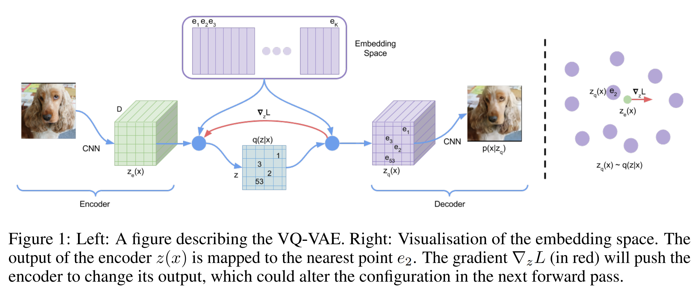

* ~~Title~~ 
* Description of algorithm 
* Problem that algorithm solves 
* How algorithm works 
* Figure / Visualisation 
* Dependencies (inc. versions) + reproducability 
* Example inputs / outputs / Plots 
* Describe pre-processing 
* Justify train/test/val splits of the data

# Generative VQ-VAE + PixelCNN for the ADNI brain data set

## 0.0 Overview
My project implements a Vector-Quantised Variation Autoencoder [VQ-VAE](https://arxiv.org/abs/1711.00937) with a 
[PixelCNN](https://arxiv.org/abs/1601.06759v3) prior for the purpose of generating fake samples based on the ADNI 
brain dataset. The PixelCNN can be utilised to generate randomised discrete representations from the latent spaced
learnt by the VQ-VAE, to consequently generate fake brain images once the reconstruction is decoded by the VQ-VAE. 

## 1.0 Algorithm Summary / Background

The purpose of this section is to provide brief background theory on the models used in my generative model. For more 
detailed description, see the original [VQ-VAE](https://arxiv.org/abs/1711.00937) and [PixelCNN](https://arxiv.org/abs/1601.06759v3).
I also found Aleksa Gordić's YoutTube video [VQ-VAEs: Neural Discrete Representation Learning](https://youtu.be/VZFVUrYcig0?si=WxpLWRl29EnONKiI)
to be extremely helpful in building understanding of the VQ-VAE model. 
 

### 1.1 VQ-VAE
To motivate the idea of a VQ-VAE, let us first revisit the idea of traditional Variational AutoEncoders (VAE). A VAE 
made up of a decoder and an encoder. The purpose of the decoder is to, given a series of inputs, learn the probability 
distribution over the latent vector space, which act as a reduced representation of the model inputs. Given the reduced 
representation, a working encoder should reconstruct this image so that is is similar to the image passed into the VAE. 

 
  
As outlined in Oord's, Vinyals', and Kavukcuoglu's paper [Neural Representation Learning](https://arxiv.org/abs/1711.00937),
a VQ-VAE differs from a traditional VAE in two key ways. The encode network outputs discrete, as opposed to continuous, 
codes, and the prior (in this implementation a PixelCNN) is learnt rather than static. The discrete representation of the
latent space is represented as a set of vectors collectively known as a codebook. Vectors from the encoder are quantised
using a Vector Quantisation layer. Figure 1 (Sourced from [this paper](https://arxiv.org/abs/1711.00937)) details VQ-VAE
architecture which was utilised in my 
implementation.

 

Initially, the embedding space it randomly intisialised using a uniform distribution and is later refined using the loss
function defined in [Neural Representation Learning](https://arxiv.org/abs/1711.00937). Namely,

Where:
* $\text{sg}$ is the stop-gradient operator
* Given some arbitrary input $x$, $z_e(x)$ and $z_q(x)$ denote the encoded, and decoded inputs
* $e$ is the unique element in the codebook in which $z_e(x) - e$ has the least euclidean norm.
* $||\cdot||$ denotes the l-2 norm.

Alternatively, the three individual terms in $L$ can be understood to represent reconstruction loss, the distance between
the encoded input and it's nearest embedding, and finally a term to 'commit' the encoder to the closest embedding.

### 1.2 PixelCNN

A PixelCNN is an autoregressive 

## ADNI Brain Dataset

## Training / Validation

## Testing / Reconstruction

## Usage

### Dependencies

## References

[1] VQ-VAE Paper - https://arxiv.org/abs/1711.00937

[2] PixelCNN Paper -https://arxiv.org/abs/1601.06759v3
