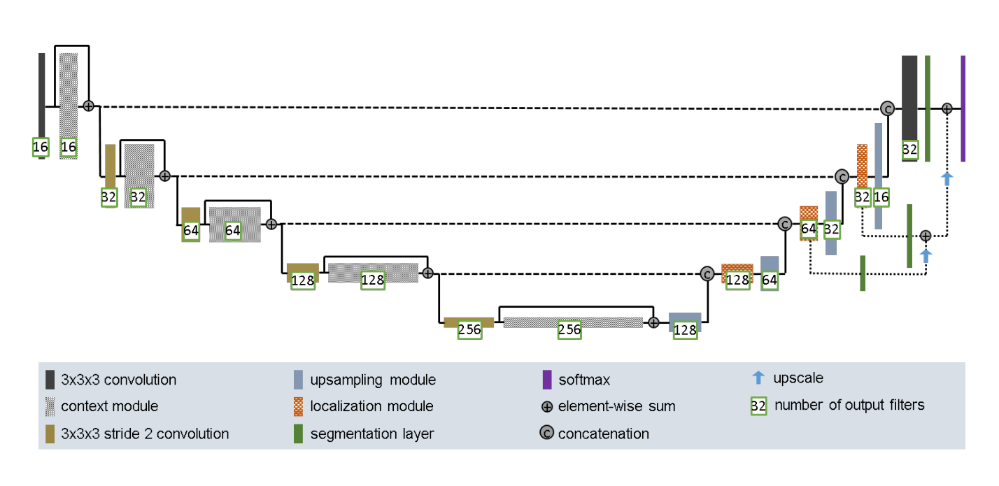

# Improved UNet arcitecture for Image segmentation of the ISIC2018 dataset
## REcognition task
The purpose of the recognition task is to perform image segmentation on the ISIC 2018 dataset. 
For testing on the test set, an average dice coefficent score [^1] of 0.8 is expected.
## Model arcitecture
The model is employed according to [^2] with changes made to acommodate for use on the ISIC2018 dataset. \
This includes changing 3d modules to 2d, and returning the output through a sigmoid function instead of softmax. \
The model uses deep supervision wich helps mitigate the vanishing gradient problem. It does this by integrating
intermediate loss signals into the output. This allows for more efficient flow of gradients during backpropegation. \
As with general UNet arcitecture, skip connections are also used for their ability to improve segmentation quality. \

The network takes a RGB channeled image as input, and outputs a binary segmentation map.

This project allows for binary image segmentation of rgb channeled mole images
## example segmentation

## dependencies
|Name   |Version|
|-------|-------|
|Numpy  |1.24.3 |
|Pytorch|2.1.0  |

[^1]: https://arxiv.org/abs/1802.10508v1
