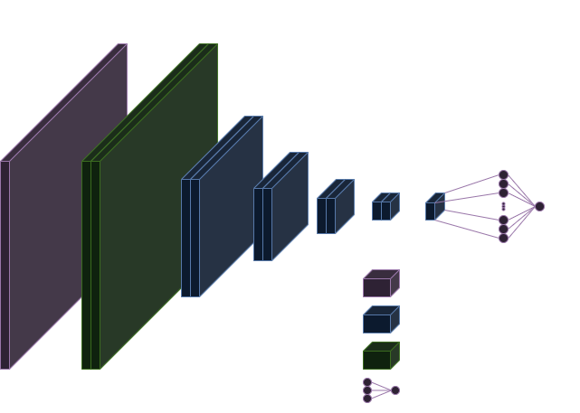

# MRI Super-Resolution Network

## Description

The MRI Super-Resolution Network developed for this project is a Super-Resolution Deep Convolutional Generative Adversarial Network (SR-DCGAN). This is a machine learning model designed to enhance the resolution of MRI images. This particular implementation uses downsampled (by a factor of 4) MRI images from the Alzheimer's Disease Neuroimaging Initiative (ADNI) MRI dataset. The dataset is preprocessed to create low-resolution versions of the images, simulating downsampled data.

The GAN consists of two neural networks: a generator and a discriminator. The generator creates high-resolution images from low-resolution inputs. The discriminator evaluates these generated images and real high-resolution images from the dataset, aiming to distinguish between them. Through adversarial training, the generator learns to create images that are increasingly difficult for the discriminator to differentiate from real high-resolution images. Both the generator and discriminator utilize deep convolutional neural networks (CNNs). These networks are used to learn complex patterns within the data. CNNs are often used for image-related recognition and reconstruction tasks.

The core objective of the network is to perform super-resolution, which means increasing the spatial resolution of the input images. In the context of MRI images, this process helps to reconstruct detailed structures that are lost during downsampling. The training process used adversarial loss to ensures the generated images are realistic and similar to real images.

## Implementation

### Generator

The code for the generator model can be found in the `modules.py` file in `Model_Generator` class. The following is structural desciption of the generator model.

### Discriminator

The code for the discriminator model can be found in the `modules.py` file in `Model_Discriminator` class. The following is structural desciption of the discriminator model.

## Dependencies

### PyTorch

### Dataset

#### Data Pre-processing

#### Train/Test Split

## Results

### Example Inputs and Outputs

### Training Results (Epoch vs Loss)

### Reproducibility

