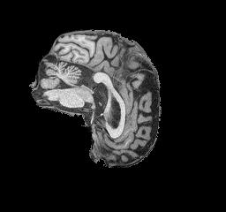
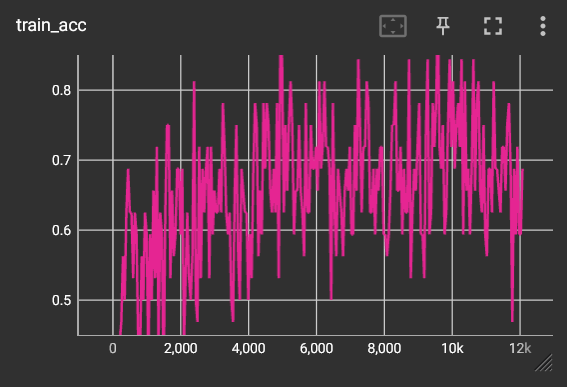
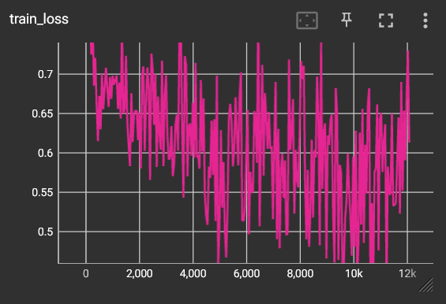
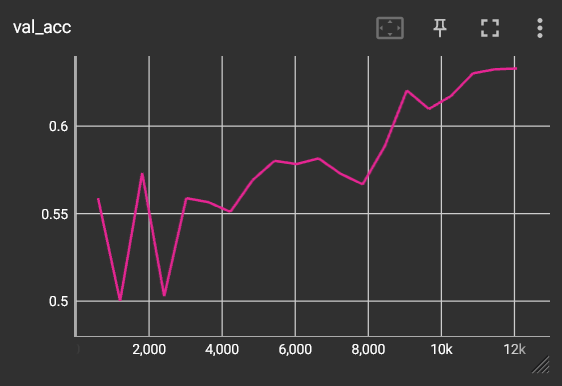

# Vision Transformer for Classification of Alzheimer's Disease

## Author 
Markus Zuegg (Student ID: 47449248)

## Project OverView

This project aims to build a deep learning neural network to classify if a MRI shot has AD (Alzheimer's Disease) or CN (Cognitive Normal) using a Vision Tranformer model (ViT) as first shown in the paper [An Image is worth 16x16 Words](https://openreview.net/pdf?id=YicbFdNTTy). Specifically this project will be a pytorch_lightning implementation of the ViT. Pytorch_lightning is a helpfull package that simplifies the code layout of deep learning models.

## Vision Transformer
The following is the overall layout of the Vision Transformer:
<p align="center">
    
</p>
The ViT splits up the whole image into patches, which it will the feed into neural network. However, becuase it doesnt know where the patches are positional encoding is used to embed information about each patch's location respective to eachother. The ViT, like other tansformers, uses multi-head attention which can be trained to adjust their weights. Which then is fed into a MLP which is used to classify the image.

Specific Encoder block vs usual encoder block:
<p align="center">
    
</p>
This specific layout for the ViT encoder was proposed by [Ruibin Xiong et al. in 2020](http://proceedings.mlr.press/v119/xiong20b/xiong20b.pdf) and uses pre-layer normlization(b), not in between residual blocks like conventual ViT's (a). This new layout supports better gradient flow and removes the need for a warm-up stage learning rate schedular.

## Enviorment Dependencies
These packages/ software need to be installed as to run this model:
- python 10.7
- cuda 11.8
- pytorch 2.0.1
- pytorch_lightning 1.9.5
- pysoundfile 0.9.0 for windows or sox if linux
- tensorboard 2.14.5

## Repository layout

`readme_imgs` contains images used in this README.md file

`ViT_Pytorch_lightning` folder contains all scripts for model dataset and training

    - `dataset.py` contains data loading class

    - `modules.py` contains all neural network architecture

    - `train.py` contains main ViT class and ablity to train/save model

    - `predict.py`contains scripts to load previous checkpoint and test that model
    
    - `Data` folder storing data should be located here

## Data set
This project uses the provided [ANDI 2D MRI brain slices](https://cloudstor.aarnet.edu.au/plus/s/L6bbssKhUoUdTSI). Which orginally contains only train and test splits. Which given by the name of the filenames, are assumed to already be patient level split. So we will manually split the train set into a 90-10 train val, this i found was a good mix with enough training samples still left in circulation. 90-10 of patients as to ensure each patient stays in either train, test or val and not more than 1. As this would lead to data leakage.
Data layout as shown below:
```
ANI/
    AD_NC/
        train/
            AD/
                images.jpeg
                ...
            CN/
                images.jpeg
                ...
        test/
            AD/
                images.jpeg
                ...
            CN/
                images.jpeg
                ...
        val/
            AD/
                images.jpeg
                ...
            CN/
                images.jpeg
                ...
```
Example of Data:


## Usage

## Results

# Model 1
Model 1 was trained on these specific hyperparameters:
```
"embed_dim": 256,
"hidden_dim": 512,
"num_heads": 8,
"num_layers": 6,
"patch_size": 8,
"num_channels": 3,
"image_size": [256, 240],
"num_classes": 2,
"dropout": 0.2,
lr: 3e-5
batch_size: 32
epochs: 20
```
The train loss, acc and validation loss, acc are shown below:





## Disscussion

## Conculsion

## Refrences

## Code refrences
