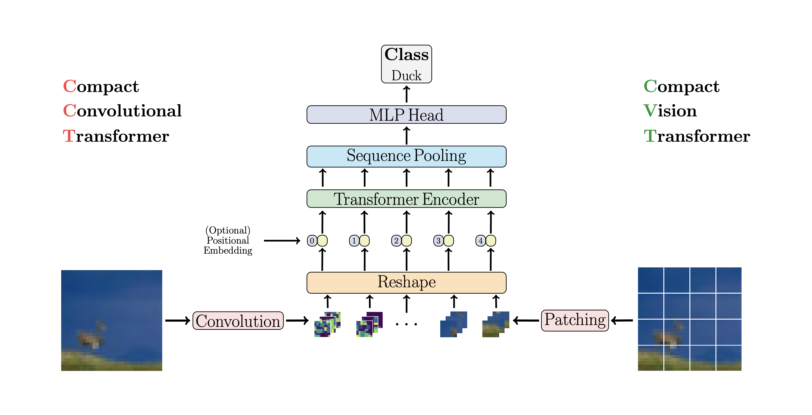
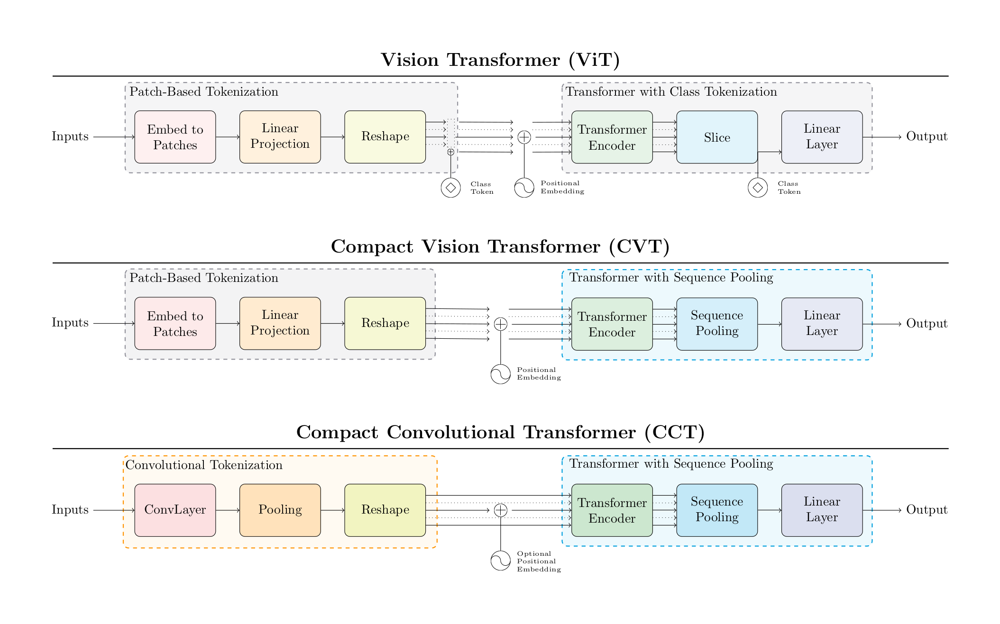
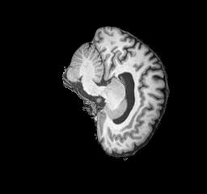

# Viva la Vision Transformers: A Transformer-Based Approach to ADNI Alzheimer's Classification

## Introduction

### About the problem

Alzheimer's disease is a major healthcare challenge affecting millions of individuals. Early detection is crucial due to the absence of effective treatments even in this era of modern medical technology [1]. Computer-aided machine learning, including SVM and deep learning methods like CNN, show promising growth in this field and tries to predict alzheimer's using pattern-recognition. This report tries to identify alzheimer's disease using state-of-the art deep learning architecture Vision Transformers.

### About the dataset

The dataset used for this report is Alzheimer's Disease Neuroimaging Initiative (ADNI) for alzheimer's disease classification [2]. There are two classes based on which the classifier trains and classifies, namingly Alzheimer's disease (AD) and Normal Cognitive (NC).

**AD**: This class represents individuals who have been clinically diagnosed with Alzheimer's disease  
**NC**: This class includes individuals who are cognitively normal and do not exhibit signs of Alzheimer's disease

The general input for this particular dataset consists of 3D images and the input is modelled in 3D, but for this
report we consider a 2D setting.

To view the dataset format used in this report refer appendix 3.

## Model Architecture

The model architecture for this report is inspired by two main research papers, namingly "AN IMAGE IS WORTH 16X16 WORDS: TRANSFORMERS FOR IMAGE RECOGNITION AT SCALE" [3] and "Escaping the Big Data Paradigm with Compact Transformers" [4].

The initial model trained and tested was based on vision tranformer with patching, in this architecture the images are broken into patches and then the linear projection of the patches undergoe positional embedding (this is because that transformers unlike CNN's cannot place the patches in a sequential order hence positional embedding is carried out so that the transformer knows the relative positions). After this part, we now move to the classical transformer encoder block to execute attention mechanism and other neural-network tasks such as normalizing. Finally, the output from the last encoder layer is used for classification task this is achieved by adding a MLP head which assigns class probabilities and classifies the images into their classes (in this case either AD or NC). 

 

Turns out the above described model is no exception to the power of transformers to engulf and memorize the whole training data hence overfitting. This was counter attacked by adding a convolution layer to extract features from the image, instead of using a traditional patching approach. In this report considering the computational limitations, 2 convolution layers were added to extract the image features. After extracting the features the input is now passed to a traditional embedder and followed by the classical vision transformer model flow.

 

 

## Report structure

### Flow
The report first calls the predict.py file, which in-turn loads dataset.py, train.py and module.py  

### dataset.py

This file acts as the data-pipeline for the report.

File contains:
* Dataset loading
* Augmentation
* Calculation of mean and standard deviation to normalize the images
* Tranforming images:
    * Resizing the 256x240 image to 256x256
    * RandomAug with n_ops = 4
    * Normalizing data

### train.py

This file contains all the necessary modules required for training

File contains:
* Model Parameters
    * CCT Parameters
    * Loss measure (Criterion)
    * Optimizer
    * Learning Rate Scheduler
* Tensorboard
* Two functions, function which has validation and the other one purely to test without validation.

### module.py

This file contains the model CCT which was explained in the model architecture heading

### util.py

This file contains all the miscellaneous necessary functions for this report

It includes:
* Patient level data split
* Graph to visualize normalization

### predict.py

This file acts as the main file, initializing all the above mentioned .py files
This file contains:
* Testing of the model
* Saving the model
* Plotting losses and accuracy graphs

## Experiments

This report includes various hyper-paramter tunings and model testings, the below tables record the observations by
first presenting the optimal mode and also displaying other attempts (models with very low accuracy were not recorded)

### Optimal Model:

This model attains a test accuracy of 89%

**Table 1**

| Model      | Optimizer | Embedding Dim | Number of Layers in CNN | Accuracy
| :---        |    :----:   | ---: |  ---: |  ---: |
| CCT      | Adam      | 192   | 2 | 92.52% |

The optimal model contains:
* Intial learning rate of 0.0002 (after various tuning)
* The optimizer finalized is adam (after trying other optimers such as SGD, AdamW, Adagrad, RMSprop)
* Model CCT was chosen for this dataset (after trying various other models from [5])
* Random Augmentation is carried out using RandAugment of pytorch
* Normalizing the image was carried out
* Patient level split was done
* Image was resized to 256x256
* Number of epochs trained - 1000
* Number of convolution layers were 2
* The train test and validation splits are 70%, 15% and 15% respectively (These splits were expiremented for better performance and inspired by famous papers).
* Batch size for train was 32 (computational limitation), for test and validation is 100
* Embedding dimensions - 192
* Number of heads - 6
* Mixed precision is used
* LR schedulers were tried (see appendix 1)
* No special dropouts were added in this setting

**Table 2**

| Model      | Optimizer | Embedding Dim | Number of Layers in CNN | Augmentation | Accuracy |
| :---        |    :----:   | ---: |  ---: | ---: | ---: |
| DViT     | Adam      | -   | - | Horizontal Flip | 61% |
| CCT   | Adam        | 192 | 4    | Horizontal Flip | 71.73% |
| CCT   | Adam        | 192 | 2    | Horizontal Flip | 72.3% |
| CCT   | Adam        | 192 | 2    | Horizontal Flip + Random Rotation | 74% |
| CCT   | Adam        | 192 | 2    | RandAugment | 76.373% |
| CCT   | Adam        | 192 | 2    | RandAugment (n_ops = 3) | 76.5% |
| CCT   | Adam        | 192 | 2    | TrivAug | 75.244% |

Table 2 is trained without patient level split
Various other training were carried out (please refer appendix 1)

## Results

### Input 

#### Before pre-processing

1. **AD:**
 

 

2. **NC:**

 

#### After pre-processing

**Example 1**

 

 

**Example 2**

 

### Plot

#### Train Loss (After Transformation) + Valid Loss (No Transformation)

* Here X-axis is the number of epochs and Y-axis is Loss.
* The un-usual plot difference between train and validation is mainly due to the pre-processing effects
and also depends on the number of training and validation images (since loss for a misclassification is a sum over all probabilities)[7].

#### Validation Accuracy

* Here X-axis is the number of epochs and Y-axis is Accuracy.

#### Confusion Matrix

#### Classification metrics (scores)

**Table 3**

| Sensitivity      | Specificity | Precision | NPV | F1
| :---        |    :----:   | ---: |  ---: |  ---: |
| 91.96%      | 93.10%      | 93.36%   | 91.66% | 92.66% |

* Sensitivity -  It explains how many of the actual positive cases we were able to predict correctly with our model. Recall is a useful metric in cases where False Negative is of higher concern than False Positive.
* F1 Score - It gives a combined idea about Precision and Recall metrics. It is maximum when Precision is equal to Recall.
* Precision - It explains how many of the correctly predicted cases actually turned out to be positive. Precision is useful in the cases where False Positive is a higher concern than False Negatives.
* Specificity - It measures how many observations out of all negative observations have we classified as negative.
* NPV -  How much we trust your model when it predicts the negative class.

 

The above definitions were inspired from [8,9]

### Rangpur Performance (refer appendix 2)

## Discussion

This report analyzes the ADNI dataset with Convoluted Vision Transformers to enhance performance,
there are other ways to improve the accuracy, for one instance we can change the setting of the input to
3D so that we have a real life representation.

## Package Dependencies

* Pytorch - 2.0.1+cu117
* Numpy - 1.24.3
* Pandas - 2.1.0
* Torchvision - 0.15.2+cu117
* Matplotlib - 3.7.2
* argparse - 1.1

## Appendix

### Appendix 1 

Format: Job(short form) - Model and Changes - Accuracy (in %)

* 750 - DViT - 60.6%
* 754 - CCT - 71.73%
* 783 - CCT 2 layers - 72.3%
* 975 - CCT 2 layers + RandomRotation (5) - 74%
* 1112 - RandomAugment - 76.377%
* 1152 - RA + 150 E - 76%
* 1199 - RA + 150 E + n_ops = 3 - 76.5%
* 1220 - TrivialAugmentWide, E - 80 - 75.244%
* 1231 - TrivialAugmentWide, E - 200 - 76%
* 253 - RA + 100 E + n_ops = 4 - 77.155%
* 1307 - RA + 100 E + n_ops = 3 + LR: 1e-4 - 75.64%
* 1364 - Data Leakage (only test) - 75.5%
* 1438 - RA + 100 E + n_ops = 5 - 76%
* 1439 - RA + 100 E + n_ops = 4 + magnitude = 11 - 76.53%
* 1478 - RA + 100 E + n_ops = 4 + Heads = 8  - 76.244%
* 1590 - RA + 55 E + n_ops = 4 + Heads = 8 - 75%
* 1604, 1607 - 10E + LR Scheduler - 69.5%
* 1642 - OnceCycle (outside) - 72.6%
* 1778, 1784 - OnceCycle (inside) - max_valid (81% in 47 E)
* 1785 - Kernel size (6) - valid (78.6)
* 1806 - embedding_dim = 96 - valid (77.3)
* 1894 - OnceCycle (inside) stop at 81% + E - 60 - 78.156%
* 1925 - OnceCycle (inside) stop at 81.5% (changed if loop) - 77.88%
* 1954 - OnceCycle (inside) stop at 81.5% + E - 200 (changed if loop) - 78.28%
* 1968 - OnceCycle (inside) stop at 80.5% + E - 100 (changed if loop) - 77.888%
* 1996 - OnceCycle (inside) stop at 81.2% + E - 100 (changed if loop) - 77.31%
* 2009 - OnceCycle (inside) stop at 81% + E - 100 (changed if loop) - 78.155% (STANDARD)
* 2306 - OnceCycle (inside) stop at train<valid + 82% + E - 100 (changed if loop) - 76.77%
* 2171 - STANDARD + Normalization - DOWN
* 2451, 2452, 2453 - Patient Level Split - 82%
* 2478 - No Stopping in predict + Patient level - 83%
* 2481 - No Stopping in predict + Patient level + 95% stopping
* 2512 - No stopping

### Appendix 2

Testing took 12.090750217437744 secs or 0.2015125036239624 mins in total

 

Test Loss: 25.257294412781675 Test Accuracy: 92.5219298245614

### Appendix 3

#### Data Split

**Patient Level Split**

* Patient_Split
    * test
        * AD
            * patient id's
                * patient images
        * NC
            * patient id's
                * patient images
    * train
        * AD
            * patient id's
                * patient images
        * NC
            * patient id's
                * patient images
    * valid
        * AD
            * patient id's
                * patient images
        * NC 
            * patient id's
                * patient images  

## References
1. https://www.frontiersin.org/articles/10.3389/fnagi.2019.00220/full
2. https://adni.loni.usc.edu/
3. https://arxiv.org/pdf/2010.11929v2.pdf
4. https://arxiv.org/abs/2104.05704
5. https://github.com/lucidrains/vit-pytorch/
6. https://github.com/SHI-Labs/Compact-Transformers
7. https://discuss.pytorch.org/t/cant-explain-the-difference-test-loss-vs-train-loss/73869
8. https://neptune.ai/blog/evaluation-metrics-binary-classification#:~:text=What%20exactly%20are%20classification%20metrics,to%20classes%3A%20positive%20and%20negative.
9. https://www.analyticsvidhya.com/blog/2021/07/metrics-to-evaluate-your-classification-model-to-take-the-right-decisions/
* Image reference https://arxiv.org/abs/2104.05704

Some parts of the code was inspired by: https://github.com/lucidrains/vit-pytorch/ and Pytorch official website