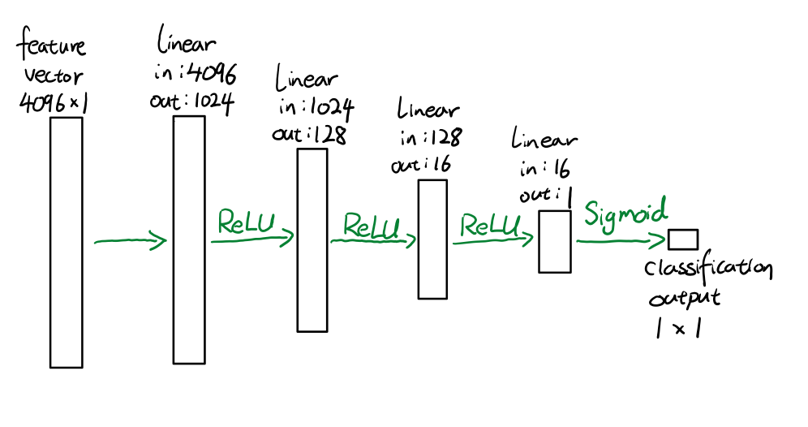
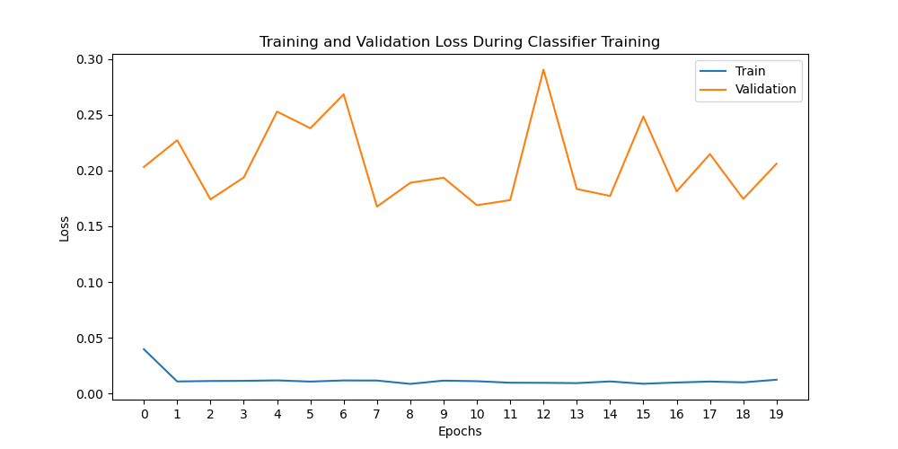
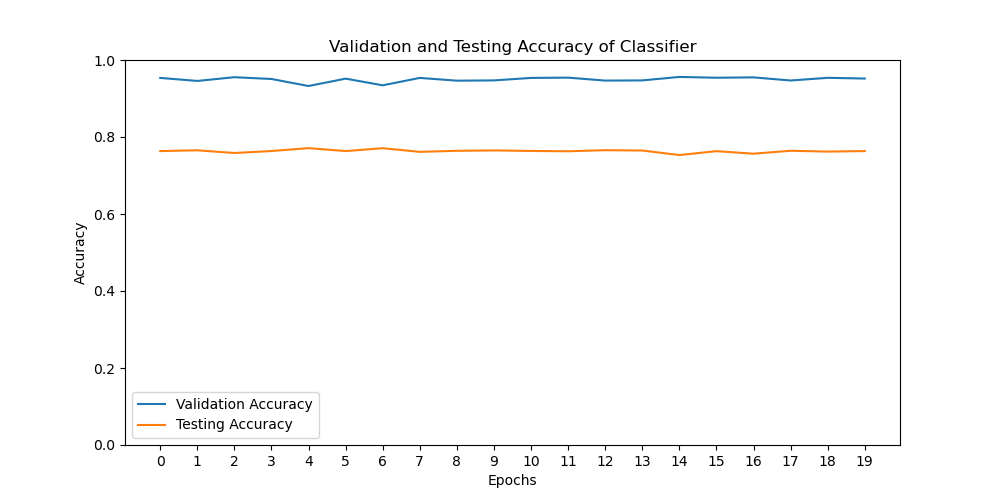

# Identification of Alzheimer's Disease in Brain Scans Using a Siamese Neural Network
Project by Minhao Sun. 

This project is a part of the University of Queensland's COMP3710: Pattern Recognition and Analysis course in Semester 2, 2023.

# Project Overview
The project aims to classify brain scans in the Alzheimer’s Disease Neuroimaging Initiative (ADNI) brain dataset as being either Cognitive Normal (NC) or suffering from Alzheimer's disease (AD). 
It achieves this through representation learning using a **Siamese network** with a twin **embedding network** structure.

A Siamese network is a neural network architecture that consists of two or more identical subnetworks that share the same model weights. 
In the present project's case, the Siamese architecture allows the **embedding network** to learn to generate similar feature vectors for images of the same class and dissimilar feature vectors for images of different classes. Once the **embedding network** is trained, a separate **classifier** is trained to classify the feature vectors generated by the **embedding network**.

The final model works by passing the (preprocessed) images through the trained **embedding network** to generate a feature vector. 
The feature vector is then passed through the trained **classifier** to generate a prediction. The project is implemented in Python 3.11.4 using Pytorch (see below for other dependencies). It is capable of achieving a final classification accuracy of approximately 78% on the test set.

> [!NOTE]
> Figures of the model architectures are provided in the section ***The Models*** in the Appendix.
>
> Training and validation loss plots, and validation and testing accuracy plots, are provided in the section ***Training and Validating the Models*** in the Appendix. Reproducibility of results is also addressed in the same section.
>
> Visualisation of the ADNI dataset (sample inputs) are provided in the section ***The Dataset and Preprocessing*** in the Appendix. The training, validation and testing split is also addressed in the same section.
>
> Example outputs of the model are provided in the section ***Using the Models for Classification*** in the Appendix.

## Project files and usage
The project contains the following items:
* `dataset.py`: contains code for preprocessing and loading data
* `modules.py`: contains the components of the models used in this project
* `predict.py`: contains code demonstrating example usage of a trained model
* `train.py`: contains code for training, validating and testing of the models
* `utils.py`: contains code for loading and saving the models
* `CONSTANTS.py`: defines global constants for filepaths to be used in the project
* `BSD_new.txt`: see the section ***Open Source Acknowledgement and Licences***
* `README.md`: this README
* `/assets/`: contains images used in this README

## Dependencies
This project is developed in the following environment:
* python 3.11.4 
* pytorch 2.0.1
* torchvision 0.15.2
* numpy 1.25.0
* matplotlib 3.7.1

&nbsp;

# Appendix: the Project in Detail
The following sections details the technical aspects of the project. It is intended as a supplement to the overview above.

## Defined Terms
The following terms are given specific meanings: 
* torch: Pytorch
* `nn`: Pytorch's Neural Network module, `torch.nn`

&nbsp;

# The Models
The project makes use of three models which are located in `modules.py` and inherit from `nn.Module`. The models are:

## The Siamese Backbone / Embedding Network
This is the network used to generate the embeddings used by both the overall the Siamese Network and the classifier. It is defined in the class `SiameseTwin`.

### The final model architecture
The embedding network used in this project closely follows the architecture proposed by Koch, Zemel and Salakhutdinov1. The size of the layers are modified to suit the image size of the (transformed) ADNI dataset. The network architecture is illustrated in the diagram below:

The network architecture of the embedding network

### Other architecture attempted
The project also experimented with two other embedding network architectures. 
First, the project attempted to use the embedding network architecture proposed by Liu et al2. Briefly, the proposed embedding network can be described as a 6-layer fully-connected neural network with 1024 nodes per layer. However, the architecture did not perform as well as the Koch, Zemel and Salakhutdinov architecture in testing, both in terms of loss and in terms of final classifier accuracy. Therefore, the architecture was not adopted. 

The project has also attempted to use VGG16 with minor modifications as its embedding network. The general structure of the VGG16 network is well documented3, and the only modification made to the general VGG16 structure was in the final fully-connected layers such that the network generated a feature vector instead of a classifier output. Ultimately, the VGG16 embedding network performed similarly to the Koch, Zemel and Salakhutdinov architecture in testing in terms of loss and final accuracy. It was not adopted because VGG16 took longer to train compared to the Koch, Zemel and Salakhutdinov architecture. 

## The Overall Siamese Network
The overall Siamese network used in this project is defined in the class `SiameseNeuralNet`. Its architecture is illustrated in the diagram below. 

The network architecture of the overall Siamese network

## The Classification Network
The classifier used in this project is defined in the class `SimpleMLP`. It performs binary classification on the embeddings generated by the Siamese backbone. 
As the name suggests, the final model architechure is a simple multi-layer perceptron. The network contains four fully-connected layers and its architecture is illustrated in the diagram below:

The network architecture of the classifier

&nbsp;
# The Dataset and Preprocessing
The project uses the Alzheimer’s Disease Neuroimaging Initiative (ADNI) brain dataset, which consists of brain scans of people suffering from Alzheimer's disease and brain scans of cognitive normal people. Images contain 3 channels and are of 256 pixels wide by 240 pixels high. The dataloading functionality of the project is implemented in `dataset.py`.

> [!NOTE]
> The file paths to the dataset are configurable via `CONSTANTS.py`.

## Training / Validation / Test Split
The ADNI dataset is provided in two subfolders: `train` (21520 images) and `test` (9000 images). 
The images in the `test` folder form the project's testing set. 
The images in the `train` folder are split on the patient level to form the project's training and validation sets. 
By default, the images of 80% of the unique patients in the `train` folder are assigned to the project's training set, and the images of the remaining 20% of the unique patients are assigned to the project's validation set. 

> [!NOTE]
>The proportion of the training and validation split is adjustable by passing a parameter to the `load_data` method in `dataset.py`.

## Transforms
Different transforms were applied to the datasets depending on their category. 
The validation and test data was converted to `Tensor` and then centre-cropped to a square image of 240 pixels wide by 240 pixels high.

In contrast, the training data was converted to `Tensor`. 20 black pixels were padded to all sides of the image, then the image is randomly cropped to a square image of 240 pixels wide by 240 pixels high.
Effectively, the test transforms amount to a random horizontal translation of each image by up to 20 pixels in each direction (in addition to resizing). This was used as a data augmentation technique and improved classification accuracy from ~65% to ~77%. Classification accuracy will be discussed further in later sections of this report.

## Pairing of Images for the Siamese Network
The Siamese network used in this project requires paired images to train. In addition, the image pairs must be accompanied by a label indicating whether or not the two images are of the same class. 

A custom dataset called `PairedDataset` was made to handle the pairing of images for the Siamese network. It wraps an existing dataset, expected to be of type `torch.utils.data.Subset` and retains that dataset's length. 
Image pairings are generated randomly such that for any given image in the dataset, it has a 50% chance of being paired up with an image of the same class and a 50% chance of being paired up with an image of the different class. The pairs are then labelled accordingly. 

## Visualisation Options
The function `test_visualise_data_MLP` allows for the visualisation of the data used to train/validate/test the MLP. A sample output is provided below: 

Sample batch containing 15 images that are used to **validate** the MLP with labels presented in human-readable form (note the absence of translation transforms)

The function `test_visualise_data_Siamese` allows for the visualisation of the data used to train/validate/test the Siamese network. A sample output is provided below. 
Note that the visualisation includes the last 15 characters of each image's filepath (excluding file extension). This was added to check that the same/different labels are applied correctly.

Sample batch containing 9 image pairs that are used to **train** the Siamese network with labels presented in human-readable form (note the presence of translation transforms)

&nbsp;
# Training and Validating the Models
The training and validation of the models are implemented in `train.py`. Two different training workflows are implemented. These are:
* A sequential training workflow where the Siamese network is trained for a specified number of epochs, then the embedding network at the last epoch is used to train the classifier
* A modular training workflow where the classifer is trained based on any pretrained and saved embedding network.

> [!NOTE]
> All plots in this section were produced with a seed of 35 for both python's `random` module and Pytorch's inbuilt pseudo-random number generator. 

## Siamese Training for the Embedding Network 
### Loss Function
As the Siamese network used in this project is designed for paired images, the contrastive loss function was used. The contrastive loss function is defined as:

$L = Y * ||x_i-y_j||^2 + (1-Y) * \max(0, m-||x_i-y_j||^2)$

where $Y$ is the label indicating whether the two images are of the same class, $x_i$ is the embedding(s) of the first image, $y_j$ is the embedding(s) of the second image, and $m$ is the margin. The loss function is implemented in the class `ContrastiveLoss` and is partially adopted from an existing implementation by Anurag Singh Choudhary3.

### Optimiser
Adam was used as the optimiser for the Siamese network with a learning rate of 0.0001 and betas of (0.5, 0.999). During testing, this confirguration was found to deliver the best performance in terms of loss and final accuracy. Weight decay and learning rate schedulers were tested, but were found to not improve the performance of the model.

### Results
Ultimately, it was found that 15 epochs of Siamese training for the embedding network resulted in the best classifier accuracy regardless of the number of epochs used to train the classifier.
This is despite the fact that the Siamese network appears to overfit the training data after 9 to 11 epochs of training in the loss plot below (note that the x-axis of the plot is 0-indexed). 

Training and validation loss plot for the overall Siamese network

## Training for the Classification Network
### Loss Function
As the classifier is performing a binary classification task, binary cross-entropy loss was used.

### Optimiser
Adam was used as the optimiser for the classifier with a learning rate of 0.001 and betas of (0.5, 0.999). During testing, this confirguration was found to deliver the best performance in terms of loss and final accuracy. Weight decay and learning rate schedulers were tested, but were found to not improve the performance of the model.

### Results
The classifier was trained for 20 epochs. 
The training and validation loss plot is shown below. 
The training loss appears to stabilise in the second epoch (epoch 1) and remain at approximately the same level throughout all remaining epochs. 
In contrast, the validation loss has a greater range of variation over the 20 epochs but does not appear to follow either an increasing or a decreasing trend.

Training and validation loss plot for the classification network

The classifier's accuracy for both the validation set and the test set is shown below. 
The accuracy of the classifier for both datasets appears to remain stable throughout all epochs. Comparatively, the testing set has a greater range of variation. 
**Ultimately, the best accuracy achieved by the classifier on the test set is 78.46%.**

Plot of the classifier's accuracy on the validation and test datasets

## Discussion
The process of training and tuning the models raised several interesting observations. 
First, given its loss plots, it appears that the Siamese network was overfitting the training data from around epoch 8 to epoch 10 onwards. 
Interestingly, despite the apparent overfitting, training the Siamese network for 15 epochs resulted in a better final classifier accuracy. 
Other attempts were made where the Siamese network was trained for 5, 8 or 10 epochs, and in all those cases, the final classifier performed worse compared to 15 epochs of Siamese network training.

A potential explanation for this behaviour is the fact that the training and validation sets in this project are split deterministicly. 
This means that, as a matter of chance, the validation dataset might have contained slightly different patterns compared to the training dataset. 
Thus, the project can be further improved by the implementation of N-fold cross-validation, which will allow more insight into the model's fit to the training data to be shown.

A second interesting observation is that there appears to be no correlation between the number of epochs of classifier training and the accuracy of the classifier. This absence of correlation appears consistently across several training runs, regardless of the number of epochs of training that the Siamese backbone received. 

A potential explanation for this behaviour is the fact that the Siamese embedding network architecture used in this project closely follows the architecture proposed by Koch, Zemel and Salakhutdinov1. 
The original paper by Koch, Zemel and Salakhutdinov was concerned with solving a one-shot image recognition task where, after the Siamese embedding network is trained, the classification network only observes a single example of each possible class before making a prediction about a test instance. 
In contrast, in the present project with a training split of 80%, the classifier is permitted to observe approximately 8400 images of the class AD and approximately 8800 images of the class NC in one epoch of training before making a prediction about a test instance.
Ultimately, given that the embedding network architecture was optimised for a one-shot recognition task, it appears reasonable that the classifier was able to achieve a testing accuracy close to the final (best) accuracy within the first epoch of training. 

&nbsp;

# Using the Models for Classification
The use of trained models for classification is implemented in `predict.py`.
In particular, two testing functionalities are available.
* `make_predictions` applies the trained models to predict the *entire* test set and provides a text-based summary of the results.
* `visualise_sample_predictions` applies the trained models to predict a *sample* of the test set and provides a visualisation of the results.

Example outputs of the model, in the visual form, are presented below:

Sample batch of predictions generated by the trained model

&nbsp;
# References
[1]: Koch, Gregory, Richard Zemel, and Ruslan Salakhutdinov. "[Siamese neural networks for one-shot image recognition](https://www.cs.cmu.edu/~rsalakhu/papers/oneshot1.pdf)" ICML deep learning workshop. Vol. 2. No. 1. 2015.

[2]: Liu, Chin-Fu, et al. "[Using deep Siamese neural networks for detection of brain asymmetries associated with Alzheimer's disease and mild cognitive impairment](https://www.ncbi.nlm.nih.gov/pmc/articles/PMC6874905/)" Magnetic resonance imaging 64 (2019): 190-199.

[3] Anurag Singh Choudhary, "[Introduction and Implementation of Siamese Networks](https://www.analyticsvidhya.com/blog/2023/08/introduction-and-implementation-of-siamese-networks/)", Web Page (accessed 20/10/2023).

## Open Source Acknowledgement and Licence
Some data visualisation code used in this project is modified based on code in [Pytorch's Data Tutorial](https://github.com/pytorch/tutorials/blob/main/beginner_source/basics/data_tutorial.py), published under the BSD 3-Clause "New" or "Revised" License. Full text of the license can be found in this project at [BSD_new.txt](BSD_new.txt).
