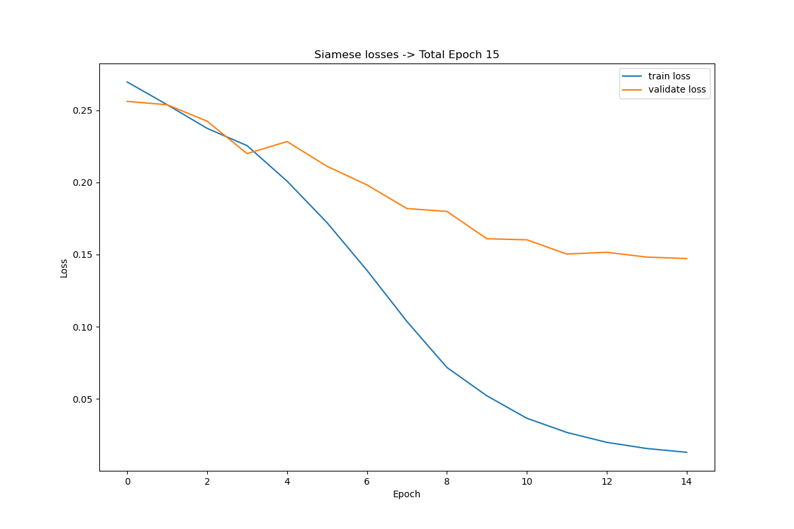

# COMP3710 Project: Siamese classification for ADNI data
**Student Number:** 46419712

## Table of Content
1. [Introduction](#1-introduction)
2. [Project structure](#2-project-structure)
3. [Reproducibility](#3-reproducibility)
4. [Model](#4-model)
5. [Train and validate loss](#5-train-and-validate-loss)
6. [Result](#6-result)
7. [Future improvement](#7-future-improvement)
8. [References](#8-references)

## 1. Introduction
The Siamese model is a powerful deep learning model that often used to assess dissimilarity between two images. In this project, this model will be adapted classify the ADNI dataset, determine whether a the brain image belongs to a patient with Alzheirmer's disease or a normal person.

## 2. Project structure
1. ```modules.py``` containing the code for the Siamese model, Siamese Contrastive Loss and Binary Classifier model.
2. ```dataset.py``` containing the data loader for loading and preprocessing ADNI data. This include split the train data to 80% training and 20% validating. This also inculude custom dataloader to handle PairDataset for Siamese model.
3. ```train.py``` containing the source code for training, validating, testing and saving the training model. The test result will be print after finish training.
4. ```predict.py``` plot the image and classify whether the image is belong to AD or NC class. This will be compare side by side with the actual label of the image.

## 3. Reproducibility
This project is reproducible, given that it using deterministic algorthm for the convolutional layer and the seed whenever random variable is used.

### 3.1. Dependencies
The dependencies of this project is install using miniconda. Here is a [link](https://docs.conda.io/projects/miniconda/en/latest/miniconda-install.html) on how to install miniconda.

The following is the dependencies and version of the dependencies.

| Dependency   | Version     |
| ------------ | ----------- |
| python       | 3.8.17      |
| pytorch      | 2.0.1       |
| torchvision  | 0.15.2      |
| matplotlib   | 3.7.2       |
| numpy        | 1.24.3      |
| scikit-learn | 1.0.2       |

### 3.2. Command to reproduce the result
Assuming all the relevant dependencies are installed.
Also, note that to reproduce the run, you will need to change the path in utils.py to match the path of your environment.

```python3 train.py```

When run the above command, it will first train the Siamese model. After that it will use the Siamese model to train the classifier model. And finally print out the accuracy of predicting the test data result in stdout. In addition, after finish running, in the "result" folder (you will need to create this folder or change the path in utils), it will return siamese.py and classifier.pt that contains the siamese and classifier model respectively. 


```python3 predict.py```

If the program is successully run, ```Siamese.pt and Classifier.pt``` exists, running predict.py will return the accuracy result in the stdout and save a random batch of test data that the model predicted the class in comparison to real class.

## 4. Model
### 4.1. Background
According to a paper by Koch, Zemel, and Salakhutdinov [1] about Siamese network for one shot image recognition, the Siamese model is best work when used to find the dissimilarity between two images. That is why, traditional Siamese model often train in a pair dataset.

**Key features of Siamese model include**

* Siamese architecture


The figure above demonstrate Siamese's architecture One-shot image recognition.

As shown from the figure, the first four layers of the model is for feature extraction, extracting important feature from the image. 


### 4.2. Implementation


### 4.3. Model limitation
When implementing the model, 


## 5. Train and validate loss




The Siamese's train and validate loss show that when training and validating, the loss is converging and getting close to one another.


However, when the image is put through the train Siamese model to extract feature vector to train the binary classifier, the loss model from the binary classifier showed that it is overfitting. This is due to the validate loss 


<div>
    
    
</div>

The t-SNE diagram shows that when evaluate Siamese model during validate using test set, there is some clear difference in the separation between the AD and NC data. However, in the train dataset used for training classifier, there is no clear dissimilarity between the AD and NC classes. This can be a good indication that there might be some overfitting in the training where for certain dataset, the Siamese model extract a good quality feature vector for differentiate between the two class, whereas for other cases, it doesn't work very well.

## 6. Result

The accuracy of the classifier model during training and validating further prove that there is overfitting in the model, where the accuracy of the train is growing while the accuracy of validate data capped at around 75%.


For this project, when run the test using the following hyper-parameter, the final result accuracy is 72.83%.


The following hyper-parameters is alter in an attempt to improve accuracy. 

The final accuracy is 72.83%
The following is the model predict of the image


## 7. Future improvement


## 8. References
[1]	G. Koch, R. Zemel, and R. Salakhutdinov, "Siamese neural networks for one-shot image recognition," in ICML deep learning workshop, 2015, vol. 2, no. 1: Lille. 
