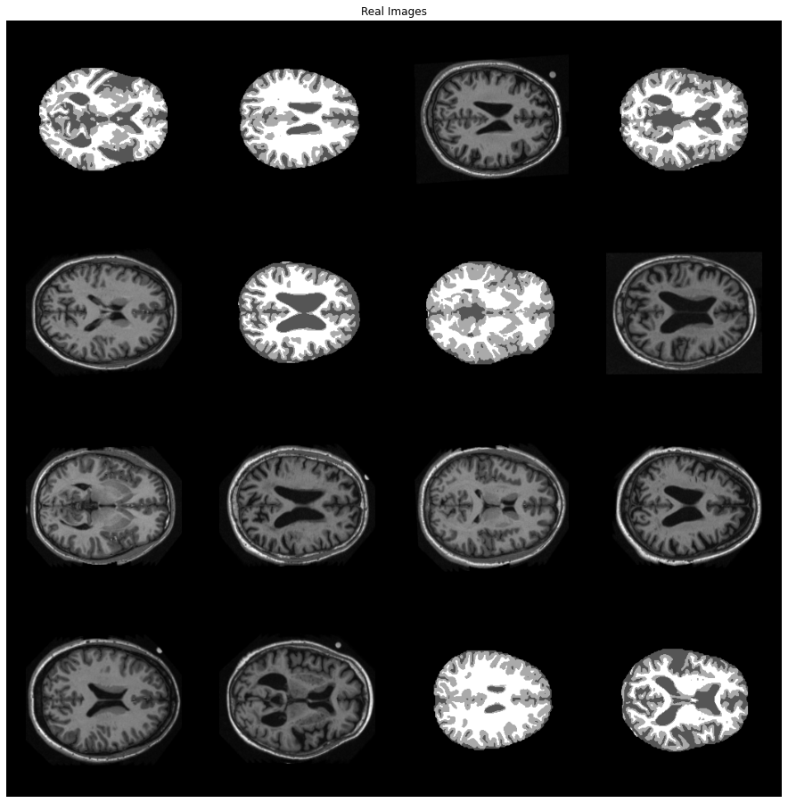
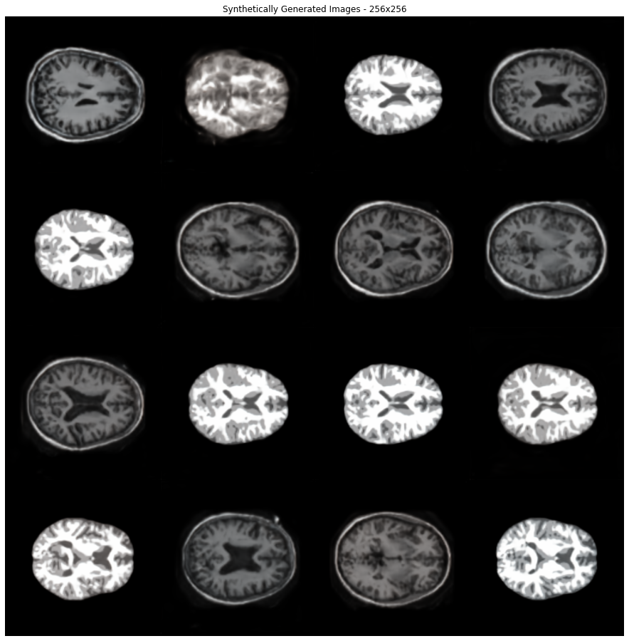
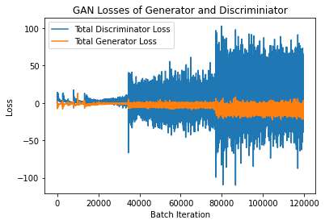
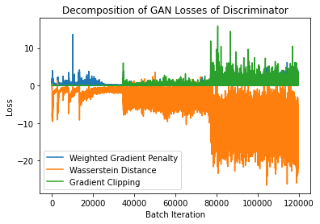

# StyleGAN for the OASIS Brain data set

Pattern recognition using a PyTorch style generative adverserial network (GAN) that is part of the COMP3710 repository. This particular implementation looks to create a generative model of the OASIS brain dataset using a variant of StyleGAN that has a "reasonably clear image".

## Motivation of synthesis with StyleGAN

A StyleGAN is used for synthesis. By learning the probability distribution to some underlying data (images in this case), it is possible to synthesis new images following the learnt distribution. There are a number of motivating reasons why a StyleGAN would be used:
- **Image synthesis** As mentioned, images can be generated from the learnt underlying distribution for artistic and entertainment purposes
- **Augmentation** When limited data are available for training, data augmentation techniques expand the available training data through image variations such as rotation, shear, and colour perturbations. StyleGAN permits a richer form of augmentation by generating brand new variations rather than limited transforms of existing data
- **Content creation** Synthesis can be used to generate new content for media, such as gaming, social media, or even movies (background generation for example)
- **Annonymity** As a result of the synthesis, new samples produced are different from the training data. This permits datasets to be generated that hide the identity of the training data, such as annonymity through face synthesis

## StyleGAN Algorithm

A traditional GAN generates images directly from the latent z. While the introduction of this technique produced impressive results, it reaches limitations due to artifacts in the output as a results of its inability to control image features. StyleGAN addresses this by learning a manifold of z via the fully connected Mapping network (see image below). The output of the Mapping network represents the style weights that feed into each synthesis layer of the GAN. Amazingly, the GAN input is no longer random, but rather a constant 4x4 image. Each synthesis block is similar to a traditional GAN, except for two important features, namely adaptive instance normalisation and noise injection. 

Adaptive instance normalisation, known as AdaIN, normalises each batch image, then scales and shifts (bias) each image by the styling weights produced by the Mapping network. Additionally, a noise injection occurs prior to AdaIN to promote variation. The consequence of applying AdaIN and noise injection is that over the full depth of the synthesis network, each layer focuses on different aspects of the generation process. Earlier layers focus on shape and composition, while later layers focus on finer details such as texture.  

## How It Works

The code is grouped as follows:
- **modules.py** Model specific classes, including the generator and discriminator classes. These are composed from the mapping network, synthesis blocks, noise injection and equalised version of convolution and linear.
- **dataset.py** Function to import OASIS training data. This can easily be swapped out for a different dataset.
- **train.py** The functions required to run the training loop that learns the model parameters.
- **predict.py** The functions required to evaluate a previous training loop and synthesize data from a trained model.
- **test_driver_train.py** A small script to initiate the training loop of the StyleGAN
- **test_driver_predict.py** A small script to run inference from a pretrained .pth model file.
- **figures** A folder for useful plots of architectures and results, referenced in this README.

The code implimenetation follows the StyleGAN architecture and follows the same naming conventions. The synthesis layers are trained as a Progressive GAN architecture, where new and existing layers are blended through an alpha term to reduce stability issues (ie shock) to the network when new layers are added.

The optimisers used for both Generator and Discriminator are Adam and the loss functions are specially defined for StyleGAN. They are described below. Note that intitially I tried BCELoss but encountered issues with mode collapse and divergence. After many many hours of troubleshooting and research I discovered this alternate technique which worked.

The loss functions for the Discriminator consist of:
- **Gradient Penalty** A regularisation technique to limit large gradients
- **Wasserstein distance** Measures how much the distribution of the Generator varies from the Discriminator
- **Gradient Clipping** Minimises the squared magnitudes of the real image discriminator output to help with stability and regularisation

The loss function for the Generator is:
- The negative of the Discriminator output on fake images.

Training and inference are controlled from a configuration dictionary which is described below:

- **batch_sizes**: array of batches per depth. This allows small batches as the depth increases.
- **channels**: array of channels per depth
- **rgb_ch**: the number of channels in the source images.
- **fade_epochs**: the number of epochs to train per depth, where the alpha blending will fade across.
- **image_folder**: training image folder.
- **generator_model_file**: Name of the model output. Requires a {0} place holder for a model per depth.
- **losses_file**: The five loss values will be written out per batch.
- **lr**: General learning rate for Adam, excluding the mapping network.
- **mapping_lr**: the mapping network learning rate for Adam.
- **lambda**: the amplification factor for scaling the gradient penalty
- **beta1**: the Beta1 hyperparameter for Adam. Controls how much weight is given to the exponentially moving average of past gradients.
- **beta2**: the Beta2 hyperparameter for Adam. Controls how much weight is given to the exponentially moving average of past squared gradients
- **z_size**: the size of the latent space.
- **w_size**: the size of the style weights output from the mapping network.

Some example inputs for training the StyleGAN from the OASIS brain dataset are:

A synthesed image is created by generating a random input z of shape (batch size, latent size). Some examples of outputs from the Generator are:

## Reproducibility of Results

Each Progressive GAN layer was run for 30 epochs. Over the six layers required to upsample to 256x256, the total training epochs were 180. On the Rangpur HPC, this typically takes about 3 hours. The generation of synthetic images is fairly stable. The image results publishing here are quite typically of the output after various training runs.

## Preprocessing

The OASIS training dataset was used, which has 10,000 RGB images of size 256x256. Each synthesis layer requires training data for a particular size. To acheive this, the preprocessing included downsampling to the required size for each layer's training. Preprocessing also included the usual normalisation across the RGB channels.

## Versioning and Dependencies

PyTorch and CUDA for version 2.0.1 is required.

Torchvision version 0.15.2 was used.

## Loss Plots

In the loss plots below, positive losses mean poorer performance, and negative losses mean improved performance. As each Progressive GAN layer is added, there is a distinct step in the losses. The six notable steps relate to the layer sizes of 8x8, 16x6, 32x32, 64x64, 128x128, 256x256. The early layers briefly indicate the GAN converging, but as the layer size increases the convergence isn't evident. The GAN likely requires further training epochs for higher layers. Note that each layer trains for longer due to the reduced batch sizes per layer.

The decomposed Discriminator losses are visualised below. This plot shows that the gradient penalty (in blue and partially hidden) and gradient clipping (in green) account for the high Discriminator losses.

## References
_T. Karras, S. Laine, and T. Aila, “A Style-Based Generator Architecture for Generative Adversarial
Networks,” arXiv:1812.04948 [cs, stat], Mar. 2019, arXiv: 1812.04948. [Online]. Available: http:
//arxiv.org/abs/1812.04948_