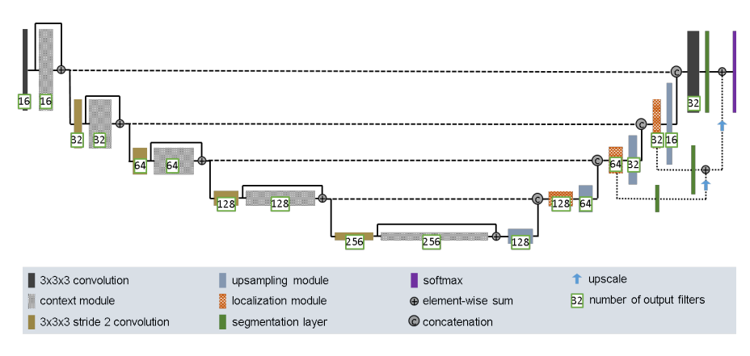
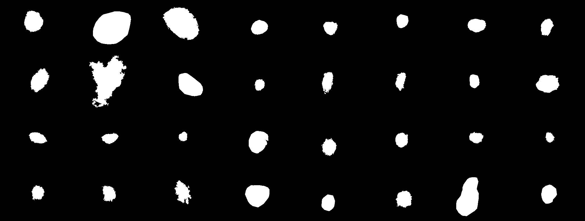
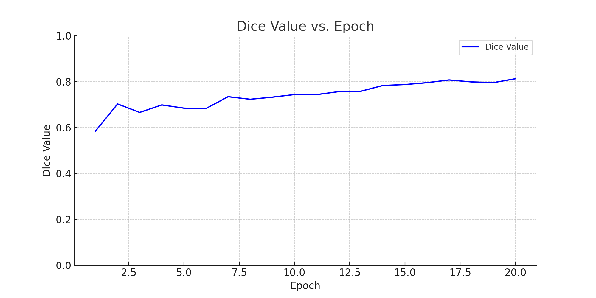
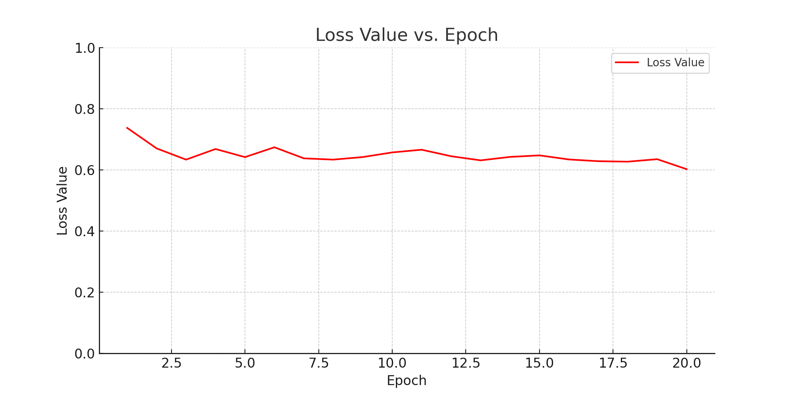

# Improved UNET for ISIC 2018 Lesion Segmentation

---

**Description:**  
This is a slightly modified implementation of the improved unet model described in this paper https://arxiv.org/pdf/1802.10508v1.pdf. The purpose of this model is to segment the ISIC 2018 Lesion dataset, ultimately achieving at least a 0.8 dice score.

---

## Algorithm

**Description:**  
U-Net models are characterized by their encoder-decoder structure, complemented by skip connections that bridge the layers of the encoder and decoder. The model developed adheres to the architecture depicted in the referenced image, with several alterations:

1. The 3x3x3 convolution layers were substituted with 3x3 convolution layers.
2. The 3x3x3 stride 2 convolution layers were swapped out for 3x3 stride 2 convolution layers.
3. The softmax layer was replaced by a 1x1 convolutional layer.

This is the structuring that was used for the modules, these were similar to the module structures in the paper, with slight alterations:
- The context modules incorporate two 3x3 residual blocks.
- The localization modules consist of one 3x3 residual block and one 1x1 residual block.
- The segmentation layers feature both a 3x3 residual block and a 1x1 residual block, with the latter outputting a single channel.

---

## Dependencies

1. `torch` - v2.0.1+cu117
2. `torchvision` - v0.15.2+cu117
3. `PIL` (Pillow) - v9.5.0
4. `numpy` - v1.24.3
5. `albumentations` - v1.3.1
6. `tqdm` - v4.66.1

---

## Example input and output

### Input (True) Mask

### Output (Predicted) Mask

---

## Graphs

### Dice vs Epoch

### Loss vs Epoch

---

The provided dataset comprises 2,594 images of lesions, each paired with a corresponding mask that depicts the ideal segmentation. This dataset was divided randomly into 85 validation images, 85 test images, and 2,424 training images. These proportions were selected to ensure that the majority of the images were utilized for model training, enhancing its performance. At the same time, a sufficient number of test and validation images were retained to provide a comprehensive evaluation of the model during both testing phases and upon the training's conclusion. As illustrated in the accompanying graphs, the validation data achieved a dice score exceeding 0.8 by the 16th epoch. Training concluded at the 20th epoch, with a final validation dice score of 0.8127 and a closely matching test set dice score of 0.8139. The loss value seemed to plateau, not going below 0.6. This indicates that there's potential for further refinement, suggesting that extended training or modifications to the model might lead to significant improvements.

