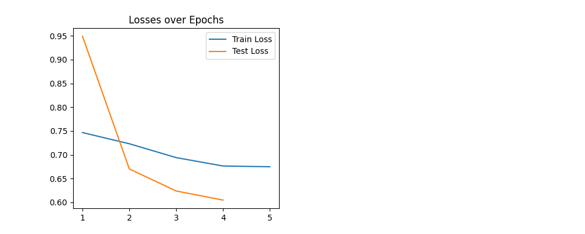
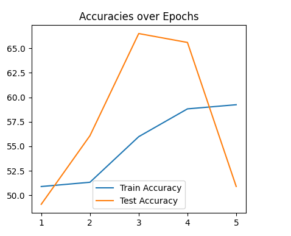

# __COMP 3710 REPORT__

# Student Information
### Name: Shriyan Garg	
### Student Number: s4676080

## __About the task__

For this report, I have done __Task 6__ , which is to classify  Alzheimer’s disease (normal and AD) of the ADNI brain dataset using the Vision Transformer. 

## __About Visual Transformer (ViT) [1]__
Vision Transformer is a type of neural network that uses Transformer architecture for image classification and computer vision tasks.

### __Architecture of ViT__
1.	__Image tokenization__: Break images into patches and convert them to vectors. 
2.  __Positional embeddings__: Add spatial context to patch embeddings
3.	__Transformer encoder__:  Process the embeddings using multi-head self-attention and feed-forward networks.
4.	__Classification head__: A linear layer is used for image classification 

## __Incorporating feedback__

### About Vision Transformer algorithm

### __Application of ViT[2]__
1.	Image classification
2.	Object detection
3.	Image segmentation
4.	Autonomous Driving

## __Information about the dataset (dataset.py)__
For this project, I used the ADNI brain dataset. I found the dataset from the BlackBoard. 
In the downloaded file, there are two directories, train and test, and each directory has 2 sub directories, AD and NC, each containing brain image slices of patients. There are 20 slices of brain image of each patient. 
Below is the image directory information:

1.	Train: (AD: 10,400 images, NC: 11,120 images)
2.	Test : (AD: 4,460 images, NC: 4,540 images)

I have done my computation on Google Colab and I have imported the dataset from Google Drive (by mounting the drive in Google Colab).
In dataset.py, I’m loading the train and test data. My implementation is in a way that will allow the users to manually input the number of images they want the model to train or test on. I have also ensured that there is no data leakage (maintained the patient level split). The images that were used for training were NOT included in the testing set.

__Image labelling__: If the image is found in the “AD” folder, then it will be labelled as 1, otherwise 0.

__Pre-processing__: In the pre-processing step, the image undergo several transformations such as random resizing, horizontal flipping, random rotation, colour jittering, conversion to tensor, and normalization. For the test dataset, the images are resized, centre cropped, converted to tensor and normalized.

## __Information about modules (modules.py)__
In my modules.py file, I've set up the Vision Transformer (ViT) for image classification. I've embedded images into patches using a convolutional layer in the PatchEmbedding class. Within the main VisionTransformer class, I've used a Transformer encoder with a specified depth and multi-head attention. For regularization, a dropout rate of 0.4 is used in both the Transformer and the Multi-layer Perceptron (MLP) head. The MLP head is responsible for outputting the final class probabilities. 

## __Information about training (train.py)__
The training is set to run for 5 epochs and uses the Adam optimizer with specified learning rates and weight decay parameters. The script also utilizes the ReduceLROnPlateau scheduler which reduces the learning rate when a plateau in the validation metric is detected. I have also implemented early stopping which will ensure that the model doesn't overfit and terminates training if the validation loss does not improve for several epochs. For usage, the best-performing model state is saved during the process. The script offers visualization as well, plotting both the training and testing losses and accuracies over epochs.

## __Information about predicting (predict.py)__
I have implemented predict.py that will take an image (either AD or NC) and then it will output the true label and predicted label. It will also tell the confidence score for both the classes and it will plot the histogram for the same. This file uses the best saved model during training (in train.py). Currently, the image path of the image that needs to be tested is required to be coded within the script, and it is assumed that the image path will contain either “AD” or “NC” so that true label can be decided.

## __Results__
Results after training are as follows:

The best accuracy on the test set was __66.50%__

#### __Loss over epoch graph__

The above graph tells about the training and testing losses over the course of 5 epochs. Following are the conclusion from the graph.

1.	__Train loss__: The training loss begins at a value below 0.75 and shows a consistent reduction across all epochs. This steady decline indicates that the model is effectively learning from the training data, refining its predictions with each successive epoch.

2.	__Test loss__: The testing loss starts at a higher point, close to 0.95. It experiences a rapid decrease in the first epoch and then continues to decline at a more gradual rate for the successive epochs. This means that initially, the model made substantial improvements in generalizing to unseen data. As epochs progressed, the rate of improvement became more controlled, showcasing that the model maintains its ability to generalize well without overfitting. It is also important to note that I got NaN as test loss in my fifth epoch. Initially, I thought this is because of exploding gradients and that is the reason why I have implemented gradient clipping. There might be some error with the test set.

#### __Accuracy over epoch graph__

The above graph tells about the training and testing accuracy over the course of 5 epochs. Following are the conclusion from the graph.

1.	__Train accuracy__: The graph starts slightly above 50% in the first epoch and sees a steady and consistent rise through the subsequent epochs. By the fifth epoch, the training accuracy reaches a value of nearly 60%, illustrating a progressive improvement in the model's performance on the training set.

2.	__Test accuracy__: It begins with a value slightly below the training accuracy in the first epoch, then exhibits a sharp ascent reaching its peak close to 66.5% in the third epoch. However, there's a notable dip in the fourth and fifth epochs, suggesting possible variability in the test dataset.

## __Results from predict.py__

For the predict.py, I uploaded a slice of AD image and this is the following result.

We can see that model correctly classified AD image with a confidence score of __52.14%__

## __Note:__
Please note that all the computation was done on Google colab and using google drive. So I needed to run all the four files. Also, please add your location for saving the model file, all the plots and loading the dataset.

## __References__
1.	https://medium.com/data-and-beyond/vision-transformers-vit-a-very-basic-introduction-6cd29a7e56f3 
2.	https://en.wikipedia.org/wiki/Vision_transformer 
