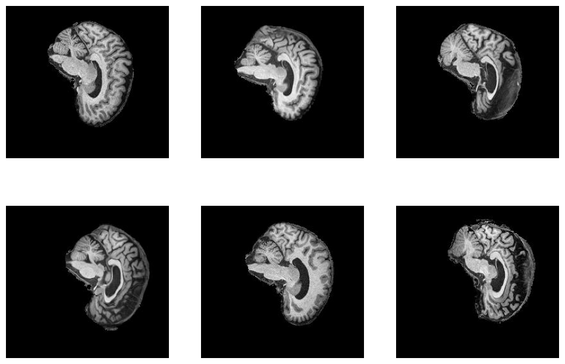
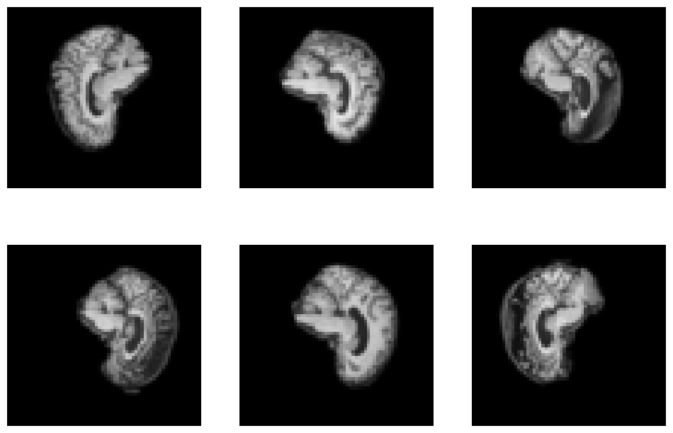

### Abstract
This project implements a brain MRI super-resolution network by training on the ADNI brain dataset. The network is trained to up-scale from 4x down-sampled input images and produce reasonably clear output images.

### Model Architecture

### Data Processing and Training Procedure
The original MRI images are 240px $\times$ 256px:

As they are loaded, a Random Horizontal Flip is applied:

Once loaded, they are downsampled by a factor of 4 using the Resize() transform:

These downsampled images are fed into the model, and the model loss is calculated using the original images.

#### Loss Function - MSE
The MSE (Mean Squared Error) loss function was used with mean reduction:
    $$ℓ(x,y)=\frac{1}{n}\sum^N_{i=1}{l_i}, \text{where }  l_i =(x_i−y_i)^2$$
For tensors $x$ and $y$ with $N$ total elements.

#### Optimiser - ADAM
The ADAM optimiser was chosen as it was the most reliable optimiser that I tested.

### Directory Structure

    data/
    └── AD_NC/
        ├── train/
        │   ├── AD-parent/
        │   │   └── AD/
        │   │       ├── 218391_78.jpeg
        │   │       └── ...
        │   └── NC-parent/
        │       └── NC/
        │           ├── 808819_88.jpeg
        │           └── ...
        └── test/
            ├── AD-parent/
            │   └── AD/
            │       ├── 388206_78.jpeg
            │       └── ...
            └── NC-parent/
                └── NC/
                    ├── 218391_78.jpeg
                    └── ...
    imgs/
    config.py
    dataset.py
    modules.py
    predict.py
    train.py
